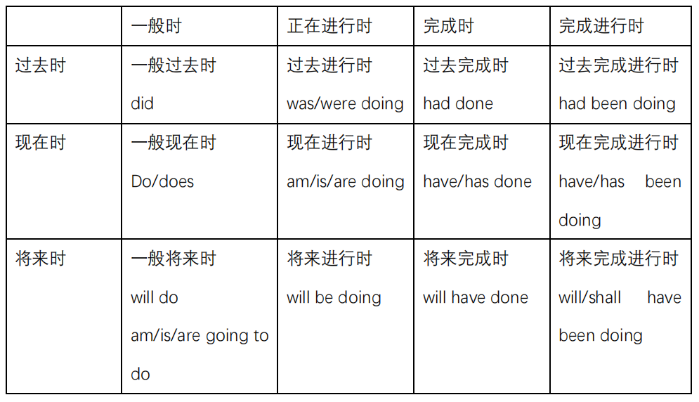
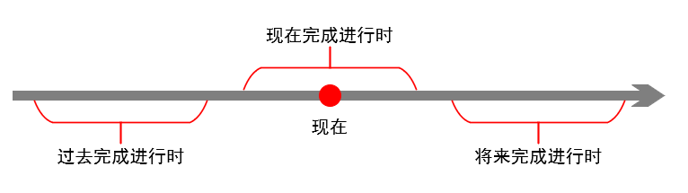
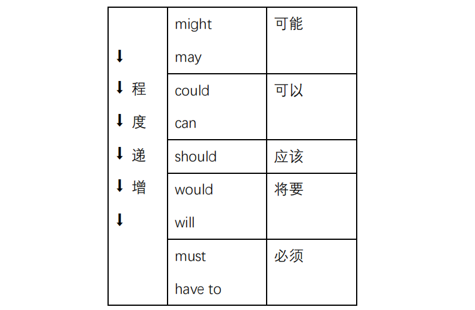
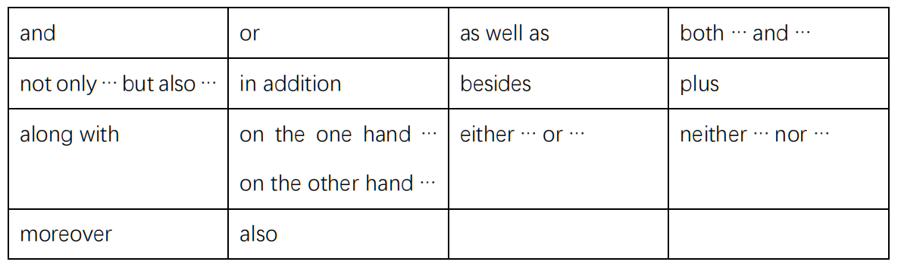
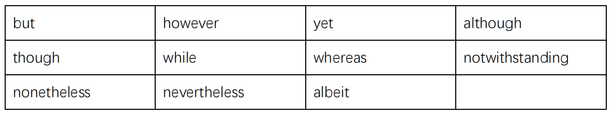
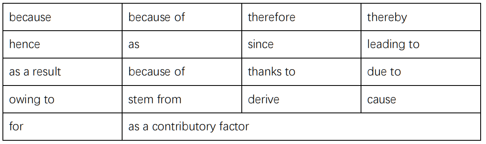

# 常用语法

## 基本句型

- 主谓宾；
- 主系表；
- there be（有……）。

## 句子成分

### 主语

- 名词、代词（如：it）；
- 主语从句；
- 形式主语。

#### 主语从句

- that ……：不翻译、不能省略；
- what、how、when、……。

#### 形式主语

```
it(形式主语) is …… (that ……)
```

### 谓语

- 动词（系动词、……）；
- 情态动词。

#### 时态



关于【完成进行时】：



#### 情态动词



### 宾语

- 名词、代词；
- 宾语从句。

#### 宾语从句

- that：在宾语从句中不做成分，可以省略，不翻译；
- who、where、……。

#### 介宾结构

介宾结构：介词 + 宾语。

### 定语

- 形容词、名词；
- 比较级、最高级；
- 定语从句；
- 定语后置（非谓语）。

#### 定语从句

当关系词在定语从句中作宾语时，关系词可以省略。

非限定性定语从句：

- 关系词不能用 that；
- 关系词不能省略。

```
……(先行词), (which ……)
```

介词提前的定语从句（介宾结构）：

- 关系词不能用 that，只能用 which、whom；
- 关系词不能省略。

```
……(A) sth. (in which sb. ……(B))

相当于：
(1) ……(A) sth.
(2) sb. ……(B) in sth.
```

> 翻译技巧：重复先行词。
>
> 1. ……的东西；
> 2. 这个东西……。

#### 定语后置

定语后置，即非谓语作定语从句。

- to do；
- doing；
- done。

### 状语

状语：表示状态的附加成分。

#### 状语从句

- 时间状语从句：when、since、after、……；
- 地点状语从句：where、……；
- 原因状语从句：because、as、since、……；
- 目的状语从句：so that、……；
- 条件状语从句：if、unless、……；
- 让步状语从句：though、while、whereas、even if、……。

### 补语

……

### 表语

#### 表语从句

- that：不能省略；
- what、why、where、……。

### 同位语

同位语：解释说明（阅读时可以适当跳过，如：介绍职位、所在学校等信息）。

#### 同位语从句

- that：在从句中不作成分，不能省略；
- ……。

> 翻译技巧：重复先行词。

## 非谓语

非谓语：不作谓语的动词。

- to do；
- doing；
- done。

### 作主语

- it（形式主语）is …… to do；
- doing。

> 注意：非谓语作主语，动词用第三人称单数。

### 作状语

- to do：表目的；
- doing：表主动；
- done：表被动。

### 作定语

- 定语在前：当作形容词；
- 定语后置：当作定语从句。

### 作表语

```
…… is (to do ……)
```

### 作宾语

……

## 插入语

插入语是句子中的一种独立成分，不作主语、谓语、宾语、补语、定语以及状语，不与其他句子成分发生结构关系，同时既不起连接作用，也不表示语气。

插入语的形式包括：

- 副词（……, however, ……）；
- 某人观点（……, according to ……, ……）；
- 介宾结构（……, on the other hand, ……）。

> 区别于同位语：
>
> - 同位语是解释说明，前后是同一个东西；
> - 插入语是插入另外一个东西。

## 连词

### 并列



### 转折&让步



### 因果



## 总结

从句先行词可以省略的情况：

- 宾语从句的先行词；
- 定语从句的先行词，且先行词在从句中作宾语。

## 虚拟语气

虚拟语气表达的是一种假设，即：如果 ……，那我就 ……。

虚拟语气常见句型：

```
I would like ...
It would be ... if I did ...
if I were ..., ... would ...
```

注意区别：

- like：喜欢；
- would like：想要（虚拟语气）。

示例：

```
Without her, I wouldn't have had much to say in the presentation.
```

> 参考资料：
>
> - [英语语法_虚拟语气的常见句型归纳_沪江英语 (hjenglish.com)](https://www.hjenglish.com/yufadaquan/p1144496/)。
