# 雅思写作

## 第一课

### 概述

写作总时长：1 小时，两篇作文（大、小）。

- task1：小作文；
- task2：大作文。

### 小作文

#### 概述

小作文（图表作文）：150 词，分值占 1/3，推荐后写（先写的坏处：没有紧迫感，花费过多时间）。

⭐ 小作文高分重点：短时间之内，将几十个数据提炼出 2-3 个宏观特征（overview）。

#### 示例

##### 示例 1

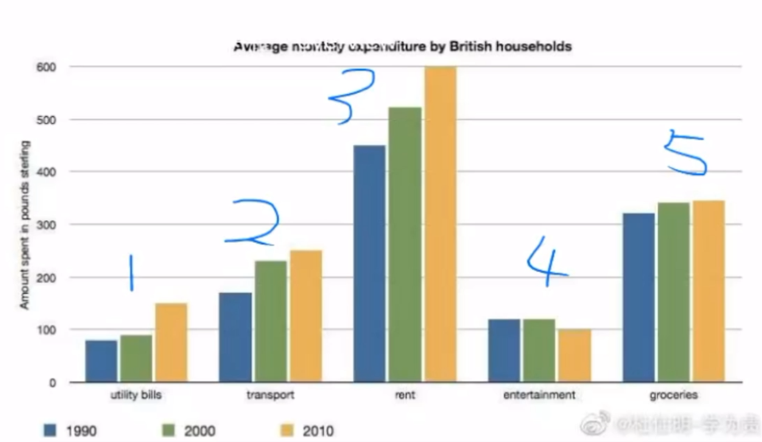

⭐ 变化趋势图要点：

- 哪些是上升的？下降的？不变的？
- 哪个是最高的？最低的？

重点：overview（总结段，第二段）。

在历年中，4 变化不大，3 最多，1 和 4 最少。

##### 示例 2

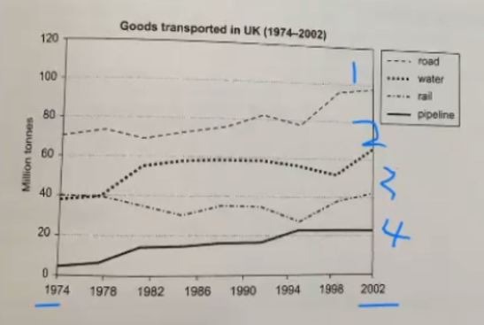

还是变化趋势图。

总结段：

- 1 2 4 上升，3 保持相对稳定；
- 1 一直是最高的，4 一直是最低的。

##### 示例 3

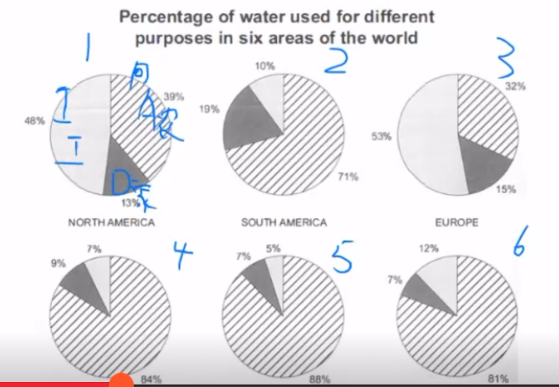

无时间变化的对比图（一般比变化图难）：

内容：3 种用水（工业、农业、家庭）在 6 个地区的使用情况。

总结段：合并同类项。

- 1 3 地区工业用水占一半左右；
- 其它地区农业用水“远多于”其它用水（比“其它地区农业用水占最多”更准确）；
- 家庭用水在所有地区占比都不超过总量的 20%。

⭐ 对比图要点：不是把每个饼的数据描述一遍，而是要会总结数据的总体特征。

#### 常用句型

描述上升趋势：

```
saw an upward trend
```

被动句：特征 + could be seen in ......

```
A dramatic increase could be seen in the proportion of older people.

老年人的占比经历了一个大幅的增长
```

### 大作文

#### 概述

大作文：250+ 字数，最好 300 字左右（+-20字），分值占 2/3（推荐先写），议论文。

高分重点：扣题 + 连贯。

#### 评分标准

##### ⭐ Task Response

Task Response（任务回应）：题型回应、限定词回应、扩展充分（重点，观点 + 解释，要补充细节）。

##### ⭐ Cohesion and Coherence

Cohesion and Coherence（连贯和流畅）：合理使用连接词、代词（they、themselves、such、……）、核心段的扩展公式。

> 核心句扩展练习：经典复盘扩展。

##### ⭐ Grammatical Range and Accuracy

Grammatical Range and Accuracy（语法的宽度和准度）。

> 课下阅读语法纠错课件：crack……
>
> 课上讲解定语和主语的多样化：修饰名词 + 主语多样化。

##### ⭐ Lexcial Resource

Lexcial Resource（词汇资源）：大量的短语搭配。

```
a sedentary lifestyle
pose a threat to (health)
have a deterring effect = act as a deterent 起到震慑作用
```

#### 核心段扩展公式

> 前提：90% 的议论文核心段都是用来分析题目相关的好处或者坏处。

##### ⭐ 公式一

在一个核心段中，只分析题目相关的一个好处或坏处（题目有限定，一边倒结构）。

1. 开门见山地给出一个明确的结论（接地气）；
2. 解释（because + 原因分析 / To be specific，细节描述）；
3. 举例（For example，非常具体，量力而行）；
4. 反证法（In Contrast / If ……，如果不怎么样 …… 则 ……，量力而行）；
5. 总结（Therefore，改写重复第一句话，为了凑字数）。

> 结论要具体，才容易扩展出后面的内容，如：钱、身体健康、学业、自然环境、某种能力、心情（压力）、就业、犯罪、安全、生活质量（衣食住行）、交通、某种性格、多样性、时间、和平、……。

##### ⭐ 公式二

在一个核心段中，分析题目相关的 2-3 个好处或坏处（discuss 或 outweigh）。

1. 使用数量词（some、many、several、a number of、two、……）引出大方向；
2. 引出第一个结论；
3. 解释第一个结论（as，原因分析，举例）；
4. 给出第二个结论（what is more，……）；
5. 解释第二个结论（since，原因分析，举例）。

> 一般不写第三个结论，因为字数可能会过多，不容易控制。

##### 作业

- 方法一经典复盘：每天选一句话，从一句话扩展成一段话，用中文即可，然后对比参考答案；
- 方法二经典复盘：每天选一句话，从一句话扩展成一段话，用中文即可，然后对比参考答案；
- 每天复习公式一、公式二，并找任意话题向自己提问，练习对一个观点进行扩展。

## 第二课

### 核心段扩展练习

……

### TR - discuss 题型

#### 出题方式

Some people think that A 观点，while others believe that B 观点.

Discuss both the views and give your opinion.

两种情况：

1. 两种观点是同一个事的好坏两面（好坏）；
2. 两种观点是两个事物的两个好处（好好，你应该给出自己觉得哪个更好）。

#### 审题思路

1. 先不带感情地分析 A 和 B 的扩展（举例分析）；
2. 然后再斩钉截铁地给出个人观点（1.要有一个明显的偏向；2.到底谁好可能会取决于具体的情况；3.缺一不可，两者共存）。

#### 写作结构

1. 开门见山引出争论（改写原题的两个观点，不要用人或物做主语，可以用动名词做主语，我们要讨论的是那个核心动作）+ 简单预告自己的观点：
   - 比较句，如：我认为 A 比 B 更合理；
   - depend on，取决于某个条件；
   - co-exist，A 和 B 都有其合理性，可以共存。

2. 扩展一方观点的合理性；
3. 扩展另一方观点的合理性；
4. 重复你的观点（详细的解释，和 1. 中自己的观点进行呼应）。

> 注意：
>
> - 第 2 段和第 3 段的篇幅要平衡，字数不能差距过大；
> - 你的观点应该只在第 1 段和第 4 段出现，第 2 段和第 3 段应该顺着题目的内容说。

#### 核心段写作方法

##### ⭐ 细节要求

1. 这两段的字数要尽可能平衡，保持在 10 个以内最好；
2. 这两段只能用第三人称；
3. 这两段尽可能多用推测语气（could、may、be likely to、tend to；尽量不要用 will 来写结果（太肯定），用 could 更好）；
4. 这两段的扩展方法要先看题目有没有给出限定，如果没有那么就根据自己的知识来决定；
5. 如果选择的是偏向型观点，那么核心段必须满足先弱后强的出场顺序（以“看电视是糟糕的”为例，那么应该先扩展好处，再扩展坏处，先弱后强，后突出自己的观点）。

> 注意：核心段是指第 2 段和第 3 段。

#### 结尾段写作方法

##### ⭐ 常用偏向型观点结尾段

Personally, I strongly believe that 我的偏向 ……  + 重复理由（Although 引出对方理由 ……，反驳这个理由 ……）。

示例：

```
我认为看电视对孩子是有坏处的。

on the one handle，看电视对孩子是有好处的。
第一个好处是 ……，因为 ……，如果不看电视，则 ……（反向论证）。
第二个好处是 ……，因为 ……。

on the other hand，看电视对孩子是有坏处的。
第一个坏处是 ……，因为 ……。
第二个坏处是 ……，因为 ……。

Personally, I strongly believe that 看电视对孩子是有坏处的，because ……（反驳好处（上面提到的好处，不要写新东西），如果没想到可以不反驳，要有对比）。
```

> 注意：
>
> - 先给结论，再做解释；
> - 连接词不要用 First，可以用 on the one handle，on the other hand 进行对比论述；
> - 可以灵活采用多种论证方式，如：反证、假设等方式。

##### ⭐ 谨慎使用“取决于”的观点

As far as I am concerned, whether …… depends on 标准 ……。Specifically speaking, if ……, then A 观点 ……。However, if ……，then B 观点 ……。

## 第三课

### discuss 题型练习

#### 示例 1

题目：

Some people think getting old is entirely bad. However, others think that life of the elderly in modern world is much easier than in the past. Discuss both views and give your own opinion.

分析：

> 注意：题目中有限定条件（in modern world），所以应该重点讨论现代的情况。

```
改写题目，描述现象。
表达观点：我认为在当今时代，老年人能够享受到的好处要多于坏处。

坏处：
1.现代科技给老年人造成了许多生活上的inconveniece。Because，现在办许多事都采用了电子流程，老年人不会使用；
2.通货膨胀使老年人的经济压力更大。Because，随着通货膨胀，老年人的存款和养老金（pension and savings）贬值，使老年人的经济压力增大。

好处：
1.更好的医疗条件，……；
2.通过社交软件，可以更方便地与家人和朋友交流，缓解了老年人的孤独和抑郁（depression）；
3.现在的老年人在退休之后，有更多的机会去追求自己的兴趣爱好。Because，现在人均寿命提高（life expectancy），老人在退休之后有更多的时间去享受生活。

总结：
我认为，虽然现在的老年人会遇到一些麻烦（对科技的陌生，高生活成本的压力），但是，他们可以通过积极地学习来适应新技术（拥抱变化，embrace ……），政府也对老人有许多的福利政策和补贴（减轻经济压力，mitigate ……）。
```

#### 示例 2

题目：

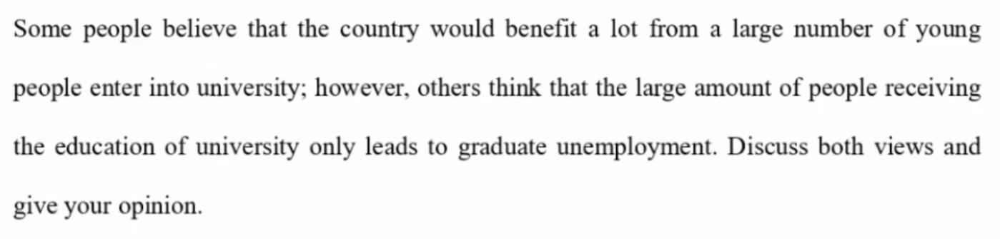

分析：

> 注意：A 观点的限定条件？好处必须是国家得到的好处。

```
对国家的好处：
大学教育的 popularization，给国家科技的进步和发展提供了助力，因为只有更多受过高等教育的人才，才能为国家研发高科技的技术，可以提升国防（national defense）等。
更多的人才做科研，发表专利（patent），为国家挣更多的钱，比如日本的尼康、佳能等，挣了许多其它国家的钱。
医学教育的普及，可以提高整个国家的医疗水平，为更多的病人提供更好的医疗服务，可以救治更多的病人。

对就业的坏处：
当大学生增多，就会造成就业市场的供大于求（when the supply exceeds the demand）。
大学教育很多都是偏理论型的，而市场上纯理论的工作比较少，学生们缺少就业的技能，导致就业困难。

个人观点：……
```

单词 & 短语：

```
critically important
fierce competition
unemployment
mitigate
ideal jobs
popularise（普及）
inferior & superior（低级的 & 高级的）
living cost（生活成本）
```

#### 示例 3

题目：

Some people think all lawbreakers should be put into prison, while others believe that there are better alternatives. Discuss both views and give your own opinion.

分析：

```
取决于犯罪的程度：
如果是 felony（重罪），则应该关进监狱，严加看管。
如果是轻罪，直接将他们关进监狱可能会使他们心生怨恨，从而变得更坏，应该采用一些其它的惩罚方式，比如参加社区服务等。
```

### TR - report 题型

#### 出题方式

题目中给出一个社会现象，要求考生回答两个问题，这两个问题不是固定的。

1. 原因分析 + 解决方案；
2. 原因分析 + 有何影响；
3. 导致问题 + 解决方案。

#### 写作结构

1. 只能改写原题现象 + 简单预告要回答的两个问题；
2. 分析两个原因（或导致的两个问题）；
3. 提供多个解决方案（根据提问来回答影响）；
4. 综上所述，改写总结前面的两个部分（虽然 ……，但是 ……）。

> 注意：第 2 段和第 3 段的字数要平衡。

#### 分析段写作方法

##### ⭐ 细节要求

专属于 report 题型的原因分析段细节要求：

1. 必须给出放之四海而皆准的原因（比如不要写中国的改革开放，老外不一定了解）；
2. 必须给出根本的 & 客观的原因分析，不要走意识流派；
3. 原因类的题目中出现比较级的时候，一定要用变化的原因来分析（比如：越来越少的人骑自行车出门，为什么？城市的扩大和科技的进步，人们出行的方式更多，比如地铁、出租车等，比自行车更加快捷和方便）。

可参考的原因出发点：生活成本不断上升、互联网的某个方面、广告增加、某种科技、人口增长、出生率下降、女性地位提高等。

##### ⭐ 扩展公式

1. 开门见山给出一个原因（The first/second reason is ……）；
2. 举例，这意味着 ……（This means that ……）；
3. 因此，引出题目相关的事实现象（As a result，……）。

##### 示例

很多人花越来越少的时间在家里，这是为什么？（分析两个原因）

```
第一个原因是，生活成本不断上升。
这意味着大人们不得不更努力工作挣钱来维持生活水平。
因此，他们花更多的时间加班 and even 做兼职，而不是待在家里。

另一个原因是，互联网提供给人们大量的休闲娱乐信息。
具体来说，社交平台上总是推荐热映的电影，高评分的餐厅，and 有趣的演出和比赛。
因此，在周末的时候，人们更有可能去参加这些活动而不是待在家里。
```

#### 解决方案段写作方法

##### ⭐ 细节要求

1. 没有逻辑链条（扩展公式），只需要超级详细地描述到底谁来做什么（比如：如何控制肥胖？教育局增加体育课的时间和项目；政府增加公共运动设施，which 建在学校和社区周围；公司增加健身房，which 能让员工在休息时间去运动）；
2. 解决方案推荐：奖励、惩罚、提高成本、法律法规、政府投资、宣传（必须细化，如：张贴海报，拍摄纪录片、广告等）；
3. 解决方案不需要和前面的原因完美对应，尽量做到就好。

##### 示例

每天有很多的食物被浪费，如何解决？

```
政府要求餐厅张贴购买的量，如几人份买多少。
政府鼓励餐厅给光盘的人一点小奖励。
```

> 注意：第二个问题可能问影响（不一定是问解决方案），要根据提问方式来做出回答。

#### 影响段写作方法

##### ⭐ 细节要求

1. 如果问的是 positive or negative，那么选择单边扩展（只写好或不好）；
2. 如果问的是 what are the effects on ……，那么根据限条件定来回答（如：越来越多的家庭选择晚生孩子，对家庭和社会的影响？对家庭而言是好的，因为夫妻可以有更多的时间拼搏事业或享受生活；对社会而言是坏的，因为会造成 an ageing population（老龄化社会））。

## 第四课

### report 题型练习

#### 示例 1

题目：

parents put a lot of pressure on children to scceed, 问原因和影响（positive 还是 negative）？

原因：

1. fierce competition（激烈的竞争）；
2. influence of social media。

影响：

1. 健康：live a sedentary lifestyle（身体健康）and develop mental problems（心理健康）；
2. 阻碍成长：focus too much on performance in academic，会让孩子在兴趣领域，如艺术、音乐等的潜能无法发挥。

#### 示例 2

题目：

Many museums and historical sites are mainly visited by tourists and not local people? Why is the case? What can be done to attract local people?

原因：

1. 博物馆展示的东西一般都是本地的历史文化，本地人对这些东西已经习以为常了，而游客们对这些东西则 know little，因此游客们会更加热情；
2. 博物馆展示的东西一般都是固定不变的，本地人去过一次以后就不会再去了，而游客们一般都是第一次去，因此游客们去的更多。

解决方案：

1. 增加一些形式新颖的活动，如：夜游博物馆、汉服拍摄，并在网络上宣传，吸引本地人去打卡；
2. 博物馆可以聘请本地人来作为讲解员，来对本地文化进行讲解，本地人会非常愿意。

> 注意：当上面公式中提供的可参考建议与题目不能很好地对应时，就从题目中的名词入手，对名词本身进行分析，会更加客观。

#### 示例 3

题目：

Today many children spend a lot of time playing computer games and little time on sports. Why is it? It is a positive or negative development?

> 可用于举例的游戏：it takes two（双人成行）。

原因：

1. 玩游戏更容易获得成就感，可以通过充钱等方式快速升级，while 运动需要长时间的练习才能有比较高的水平；
2. 玩游戏更容易实现，只需要一台电脑，while 运动需要有专业的设备、场地，需要考虑天气情况，有的还需要有朋友一起才能进行。

> 注意：这里谈原因，不要只说孩子们爱玩游戏的原因，而是应该与 sports 进行对比，写出孩子们为什么不爱运动（相比于游戏）。类似于这种有对比的题目，一定要有一个全面的回复（games 和 sports 都要涉及）。

影响（negative）：

1. 孩子们容易沉溺于虚拟世界，从而减少与实现中的朋友交流和相处的时间；
2. 孩子们容易养成 a sedentary lifestyle，不利于身体健康，while sports 能够锻炼孩子们的身体。

> 注意：这里最好不要写游戏会影响孩子们的学习，因为运动也会占用孩子们的学习时间，这是游戏和运动共同的坏处。这里在写游戏的坏处时，同样应该与 sports 对比着写，在描述游戏的坏处时，突出运动的好处。

#### 示例 4

题目：

A rise in the standard of living in a country often only seems to benefit cities rather than rural areas. What problems might this difference cause? How might these problems be reduced?

导致的问题：

1. 城市人口增多，竞争加剧；
2. 农村人口大量向城市转移，导致农村的土地无人耕种，使农村的粮食减产。

```
fierce competition  激烈竞争
lack of medical resources
labour drain  劳动力短缺
uncultivated  无人耕种
crop yield  粮食减产
```

> 注意：像这种包括两个主题（城市和农村）的，可以分开分别进行论述。

解决方案：

1. 政府可以减少甚至免除农村的税收，使更多的人愿意留在农村进行工作；
2. 政府可以在农村提供更高工资的岗位，吸引更多的人才来农村进行工作。

####  示例 5

题目：

Older people who need employment have to compete with younger people. What problems does this cause and what are the solutions?

导致的问题：

1. 对年轻人的问题；
2. 对老年人的问题。

解决方案：……

### TR - 是否赞同题型

> 注意：这是每年考察最多的题型。

#### 出题方式

题目中给出一个建议/评价/观点，要求考生回答：To what extent do you agree or disagree?

#### 审题思路

1. 我完全赞同此观点（少）；
2. 我完全不赞同此观点（多）；
3. 一分为二（必须有一个明确的立场）：
   - 取决于 ……（5:5）；
   - 有一个明显的偏向，虽然 …… 但是 ……（3:7），overall / largely。

情况三（取决于）举例：

```
城市中的旧楼应不应该拆除？

一方面，一些旧楼存在安全隐患，应该拆除。
另一方面，旧楼可以代表一个城市的历史文化，应该保护。
综上所述，……
```

情况三（有偏向）举例：

```
广告的影响（积极或消极）？

虽然，广告有时候可以让人们对产品有更多的选择，对产品有更详细的了解（好处）。
但是，广告的负面影响更多，它会让人过度消费，浪费时间（坏处）。
（明显认为广告的坏处更多）
```

情况三（有偏向）举例：

```
孩子们需要在学校上学一直上到18岁吗？

虽然，对于一些有艺术或体育天分的孩子来说，提前离开学校可以更好地发挥他们的天分。
但是，对于大多数普通的孩子来说，继续上学有以下好处：
1.可以约束孩子们的行为，避免沾上抽烟喝酒等不良行为，可以培养良好的文明素养。
2.有利于孩子们长大之后的就业，高中学历一般是就业的最低要求。
（明显认为上学的好处更多）
```

##### ⭐ 第一类题目

题目中出现极端 / 绝对词汇（最重要的 / 最好的 / 唯一）。

示例 1：

有人认为互联网是人类历史上最重要的发明，你是否赞同此观点？

```
1.改写 + 在我看来互联网不是最重要的发明，因为它和很多其它发明一样重要。
2.我承认互联网 thoroughly 改变了人们的生活和工作。
3.However，很多其它科技进步 are not less significant than the internet（不逊色于、不亚于）。
现代交通工具 / 现代医学-vaccine-antibiotic / 现代农业-pesticide-chemical fertilizer-artificial irrigation-crop yield
4.综上所述，……。
```

示例 2：

有人认为减少交通事故的最好方法是提高获取驾照的最低年龄限制，你是否赞同此观点？

```
1.改写 + 我完全不赞同这是最好的方法。
2.这个方法效果很小，因为交通事故的原因不会随着司机年纪增长而明显减少，如 road rage（路怒症）。
3.与此同时，我坚信有更好的方法来减少交通事故：提高惩罚的力度 + 提高获取驾照的难度。
4.综上所述，……。
```

##### ⭐ 第二类题目

题目中给出一个肤浅 / 弱智的观点，考察你的反驳能力。

示例 1：

有人认为超市和商店不应该销售那些被科学证明有害健康的食物和饮料，你是否赞同此观点？

```
1.改写题目 + 我完全不赞同此观点。
2.这个观点 exaggerate 这些产品对健康的危害，因为……。
3.这个观点 underestimate 这些产品的重要性：生活 + 经济。
4.综上，我认为这是一个 absurd（荒唐的）观点 + 给出建议（生产商给出这些题目的危害性，由消费者来决定是否购买）。
```

> 同类题目：极限运动非常危险，是否应该被禁止？

示例 2：

有人认为国家应该自己生产食物，尽可能不进口食品，你是否赞同此观点？

```
1.改写题目 + 我完全不赞同此观点。
2.大幅减少食物多样化，影响人们的生活质量/健康。
3.影响进出口经济。
4.抬高食物价格。
5.综上，不赞同。
```

##### ⭐ 第三类题目

题目中有两个主体，不管你的观点是什么，必须都要涉及到这两个主体。

两种写法：

1. 两者都赞同；
2. 抬一个踩一个。

示例 1：

有人认为人们应该关注现在而不用为将来做计划，你是否赞同此观点？- 两者都赞同

```
1.改写 + 我认为 not only …… but also ……。
2.一方面，关注当前的事情意义重大：打下坚实的基础（solid foundation）+ 让自己更专注。
3.另一方面，为将来做计划也很有必要：有动力 + 应对突发情况。
4.综上，…… is short-sighted。
```

示例 2：

有人认为在规划新城镇的时候，公园和广场的数量应该多于购物中心的数量，来让人们更好地度过休闲时光，你是否赞同此观点？- 抬一个踩一个

```
1.改写 + 我完全赞同此观点。
2.广场和公园扮演极其重要的角色：免费 + 活动更丰富 + 有益健康。
3.虽然人们也可以在购物中心通过消费得到压力的缓解，但是购物中心的数量不应该太多：对应的人群有限（年轻人）+ 内容重复。
4.综上，this essay will content that ……。
```

##### ⭐ 第四类题目

题目中的概念过于笼统，需要考生一分为二来回答（取决于）。

示例 1：

有人认为城市的 old buildings 应该被拆除来建造新的楼房，你是否赞同此观点？

```
1.改写 + 我认为老楼是否应该被拆除取决于他们对于城市的价值。
2.一方面，拆除一些老楼很有必要：安全/空间/美观。
3.另一方面，保留一些老楼很有必要：旅游业/当地人的归属感/给现代设计师提供灵感。
4.综上，我认为并不是所有的老楼都应该被拆除或被保留，而是应该由当地的政府做出充分的 evaluation 来进行判断。
```

示例 2：

有人认为每天接触的大量广告给人们的生活带来了负面影响，你是否赞同此观点？

```
1.改写 + 在我看来虽然大量的广告让人们了解产品信息，但是总体而言给他们的生活带来了更多负面影响。
2.一方面，广告提供的信息可以提升人们的生活质量。
3.另一方面，广告带来的负面影响很严重：浪费时间/impulsive purchase（过度消费）。
综上。
```

## 第五课

### discuss 题型练习

#### 题目

Some people think that children of busy parents should be sent to daycare centers, while others believe that they should be cared for by their grandparents. Discuss both views and give your opinion.

#### 介绍段

There are those who argue that children who have busy parents should be sent to daycare centers while the alternative stance is that grandparents are more suitable to look after them. I personally agree children should be taken care of by daycare centers, believing that they will have improved health condition and advanced social skills.

> 注意：介绍段的内容主要是改写题目 + 预告自己的观点。其中，对自己观点的介绍可以写的比较详细，只要做好改写，哪怕与后面的结尾段重复也没有关系。

#### 核心段 - 阐述 A 观点

Having children of busy parents attended by their grandparents does have plenty of advantages. One of them is that their safety could（不要用 will 或 would）be guaranteed due to the fact that grandparents are instinctively responsible to protect their offspring from danger, such as electricity and fire, and this could largely reduce the risk of getting hurt. These kids will also feel happy and beloved when they are attended by their grandparents. Afterwards, grandparents are always willing to show their patience and tenderness when they take care of their grandkids. They will try to satisfy all their grandchildren's needs, from purchasing expensive toys to preparing indulgent meals, and children will consequently have a sense of being embraced with happiness and love.

#### 核心段 - 阐述 B 观点

Advocates for daycares centers claim that these institution are playing an essential role in children's growth. The most noticeable merit comes to improving children's health condition. More often than that, daycare centers provide versatile facilities for children to exercise and hire dietitians to make nutritious recipes to ensure healthy diets. Children in those centers would have more opportunities to work out and eat balanced diets. Besides, enhancing social skills（用动名词做主语）is also a key factor which cannot be ignored. As children in daycare centers are exposed to different people, including nurses, teachers and kids at diverse ages, they may have more chances to communicate, cooperate and resolve conflicts, which will difinitely assist with their social ability.

#### 结尾段 - 表达个人观点

In conclusion, I strongly believe that sending children to daycare centers is more beneficial to their holistic development, as this pattern aid to both children's health condition and social ability. Although being supervised by grandparents can provide them safety and happiness, sometimes children can be spoiled when they are under too much love and protection.

### 语法提高 - 主语多样化

#### ⭐ 实意名词做主语

实意名词做主语：人或物（60%+）。

#### ⭐ 实意名词（修饰）做主语

实意名词（修饰）做主语：长主语（2-3 次）。

示例：

```
打算毕业以后选择一份教书工作的年轻人的数量在不断下降。

The number of young people who intend to choose a teaching job/career after graduation has been falling/reducing/decreasing.
```

#### ⭐ 动名词做主语

动名词（Doing ……）做主语：主语偏长，用于开门见山地给出结论/解决方案。

示例：

```
Allowing young people to save large amounts of money is the most significant advantage of living with parents.
```

```
Imposing higher taxes on calorie-rich food and drinks is an effective measure that should be taken by the gevernment.
```

#### ⭐ 动词不定式做主语

动词不定式做主语：It is 形容词（要具体）to do …… / that ……。

#### ⭐ 抽象名词做主语

抽象名词做主语：使用动词或形容词转换的名词做主语。

示例：

```
一般写法：
Many young people are unwilling to be a teacher, which is quite common in many places.

抽象名词做主语：
Young people's unwillingness to be a teacher is quite common in many places.
```

```
并不是每个人都对运动感兴趣。

Interest in sports is not universal.
```

## 第六课

### 语法提高 - 定语多样化

定语多样化：位置不同（后置定语）、不要过度依赖定语从句。

#### ⭐ 形容词 + 名词

示例：

```
busy parents
ambitious young people
```

#### ⭐ 名词 + 介词短语

示例：

```
families without children
parents with heavy workloads
young people under huge/enormous pressure
```

#### ⭐ 名词 + 定语从句

示例：

```
parents who are buried in work
money that was spent on food
```

#### ⭐ 名词 + 分词短语

形式：名词 + doing（主动）/ done（被动）。

> 注意：推荐用于作文的第一段。

示例：

```
parents buried in work
The number of young people intending to work as a teacher after graduation is decreasing.
money spent on food
spending/expenditure on food
There has been an increase seen in the number of young couples who decide to have their first child at an older age.
```

### TR - outweigh 题型

#### 出题方式

Do you think the advantages of this outweigh（超过） the disadvantages?

#### 审题思路

1. 必须分析好和坏的两方；
2. 必须给出一个偏向型的观点 - more …… than …… / outweigh；
3. 约等于 discuss 的偏向型观点写作。

#### 写作结构

1. 改写现象 + 预告我自己的偏向；
2. 扩展弱的一方；
3. 扩展强的一方；
4. 重复自己的偏向 + 理由（反驳对方）。

> 注意：弱方和强方最好分别扩展两个例子。

#### 示例

##### 示例 1

In some countries, more and more adults choose to continue to live with their parents after they graduate and have found jobs. Do the advantages of this trend outweigh it's disadvantages?

```
at the cost of（以……为代价）
```

##### 示例 2

In some countries, there has been an increase in the number of parents who educate their children themselves at home instead of sending them to school. Do the advantages outweigh the disadvantages?

> 注意：这道题讨论的就是 educate their children themselves at home，而不包括 sending them to school，不能专门用一个核心段来分析 sending them to school 的好处和坏处，而是应该围绕 educate their children themselves at home 展开分析。

```
1.在我看来坏处大于。
2.好处：为孩子提供更好的保护，远离校园暴力、不良行为；孩子可以获得个性化教育。
3.坏处：孩子没有机会和同龄人一起合作、解决冲突；学习的范围很有限，家长能教的科目很有限，并且没有学校的老师那么专业。
4.虽然……（好处），但是……（好处）。
```

##### 示例 3

Scientists and tourists can travel to remote natural environmental such as the South Pole. Do you think the advantages outweigh it's disadvantages?

> 注意：
>
> - Scientists and tourists 是两个主体，它们的 advantages 和 disadvantages 可能不同，需要分开来分别进行分析；
> - such as the South Pole，题目提供了举例说明，写作时应该不止于题目的例子，应该扩展更多的地方，比如 jungle 等。

```
好处：
1.Scientists：make new discoveries more easily（取得新的发现）。
2.tourists：好奇心得到满足，可以看到 astonishing/breath-taking 的美景，比如 polar light/aurora（极光）。

坏处：
1.安全问题：unpredictable weather conditions, 遇到 accident 时 far away from human resident。
2.对当地环境的影响：chemical products from daily life, 比如：交通工具的燃料、洗衣液（造成 water contamination）。
```

### 图表作文 - 复杂对比图

#### 出题方式

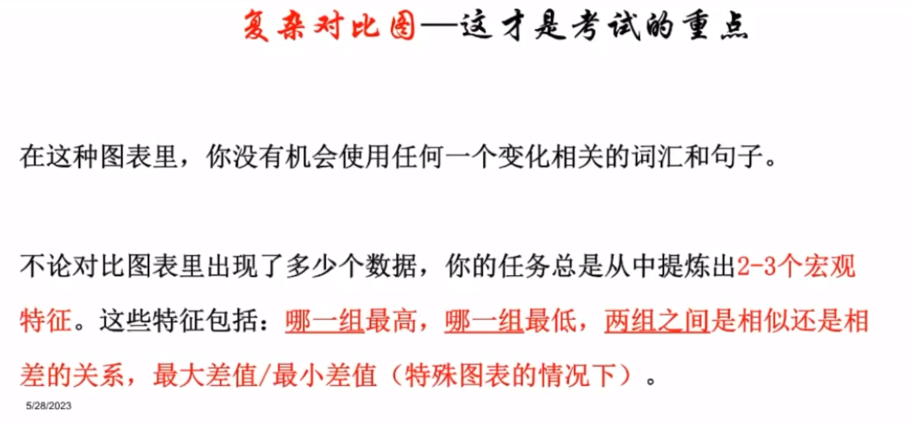

#### 写作结构

1. 改写原题文字内容；
2. Overall，总结所有宏观特征（重点、关键）；
3. 用数据扩展一个特征；
4. 继续扩展；
5. 继续扩展。

#### 示例

##### 示例 1

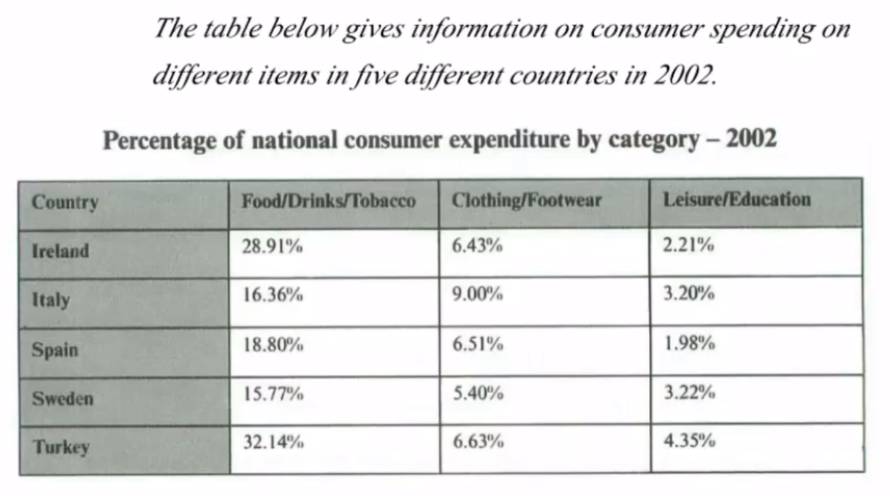

对比图 Overall 段写法（按消费类型和国家划分）：

```
总的来说，所有国家都花最多的钱在食物饮料和烟草上，which 远多于其它类别的花费，whereas 最低的花费可以看到在休闲和教育方面。
```

> 连接两个句子：句子，whereas（而）句子。

范文：

```
The table illustrate the proportion of national expending in Ireland, Italy, Spain, Sweden and Turkey on three types of consumer items in 2002.

Overall, the category of consumer goods that all countries spent most on was food, drinks and tobacco, which was considerably more than the expenditure on the other types of goods. The lowest spending could be seen in the category of leisure and education in all five countries.

In terms of/with regard to(引出主题) food, drinks and tobacco, Turkey spent the most at 32.14%. The expenditure of Ireland was also high (28.91%) compared to Sweden which spent the least (15.77%). Spain and Italy spent 18.80% and 16.36% respectively. On the other hand, the lowest expenditure was on leisure and education which accounted for under 5% in all countries. Turkey spent most on these items at just 4.35% of their national expenditure which is around double that of Spain(1.98%).

Clothing and footwear was the third category of consumer goods and outlays(支出) for those items were between 9% in Italy and 5.40% in Sweden. The national spending in this area for the remaining countries averaged around 6.5%.
```

> 注意：最好不要写结论段（In conclusion，……），这只是为了凑字数。

##### 示例 2

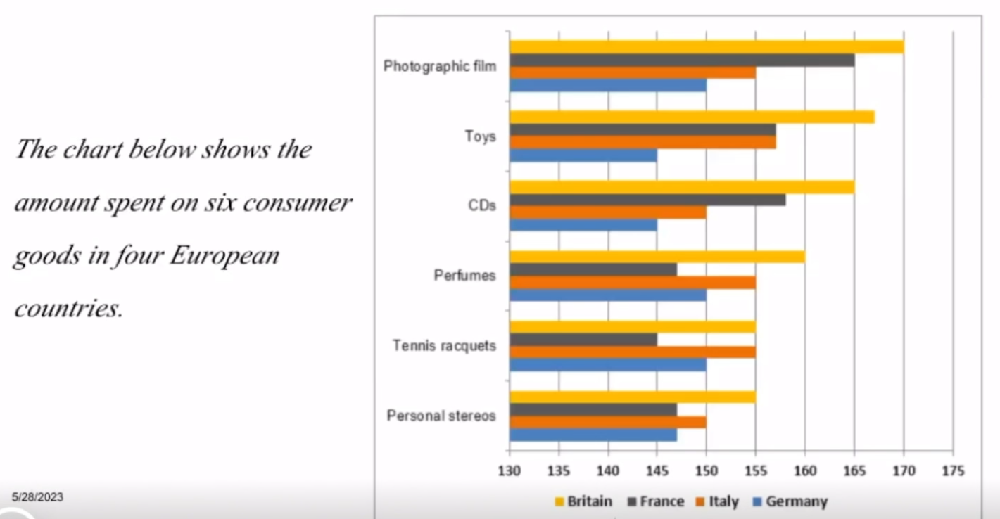

对比图 Overall 段写法（按国家划分）：

```
总的来说（In general），英国花最多的钱在每一项商品上，而德国总体是最低的消费国（spender）。法国和意大利在这些商品上的花费大体相似（approximately）。
```

> 注意：
>
> - 只要是图片里没有出现时间的题目，写作都用一般现在时，否则用一般过去时；
> - 这里必须用 Britain（和题目保持一致）做主语，而不能用 British；
> - 注意语法多样性，不要 3 句话都用国家做主语，比如可以改为：The spending on the product of France and Italy。

##### 示例 3

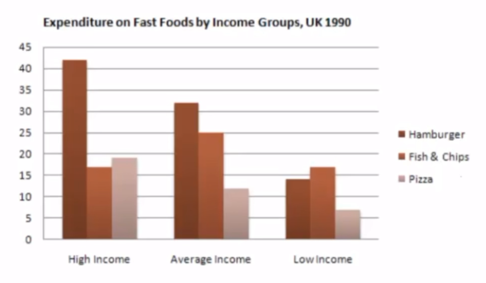

对比图 Overall 段写法（按食物划分）：

1. hamburger 的花费总体是最多的；
2. pizza 的花费总体是最低的；
3. fish & chips 的花费各不相同。

> 特点：数据不是完美特征（没有绝对最高的或最低的组）。

具体展开：

```
In terms of/with regard to hamburger，高收入和中等收入的人花费最多，低收入的人……。In contract/On the other hand, 对于 pizza, 中等收入和低收入的人花费的钱最少，分别是……，而高收入的人花费的钱是……，是三种食物中排在第二的。

对于 fish & chips，尽管他在三种人群中的数据差别不大，但是受欢迎程度却不同。它在高收入的人中是最不受欢迎的，在低收入的人中是最受欢迎的，而在中等收入的人中处于中间地位。
```

##### 示例 4

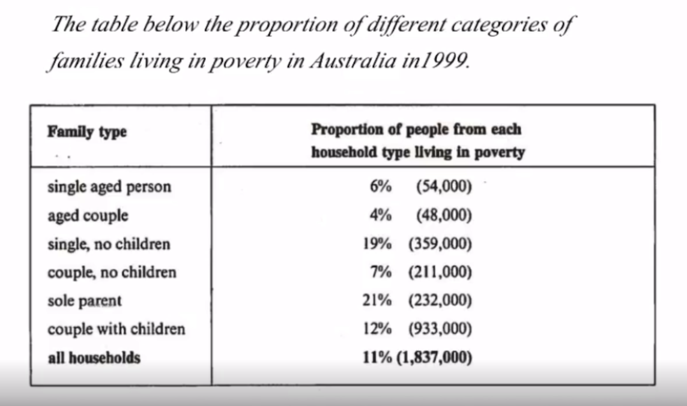

> 注意：这里看题目要求，重点是要分析 proportion（比率），即只看百分比数值，不用看括号中的数字。

结论：

1. 单身的家庭比结婚的家庭贫穷率更高；
2. 有孩子的家庭比没有孩子的家庭贫穷率更高；
3. 老年人的家庭贫穷率最低。

> 分析方法：按组分析，将具有同样特征的数据划分为一组，不同组之间的数据进行对比。其中，特征可以按多种维度进行划分，从而可以有多种不同的分组方式。

## 第七课

### 写作练习

#### 范文讲解

```
尽管那些对电脑游戏沉迷的孩子可以从中获得不少的能力，但是它们会遭受严重的健康问题。

Although the children addicted to computer games could accquire various abilities, they are highly likely to suffer from sever health issues.
```

```
The main reason (……) is ……
young person of privilege -> young people born and raised in rich countries
so -> …… and therefore ……
```

#### 方法总结

1. 介绍段做出预告；
2. 核心段扩展这些预告；
3. 结尾段重复这些预告。

#### 写作重点

1. 结构丰富；
2. 核心段内容；
3. 语法丰富；
4. 词汇。

### TR - 判断好坏题型

#### 出题方式

Do you think it is a positive or negative development?

#### 审题思路

> 约等于 agree or disagree？（是否赞同题）。

1. 思路一：我认为这是好的趋势（分析 2-3 个好处）；
2. 思路二：我认为这是坏的趋势（分析 2-3 个坏处）；
3. 思路三：是好是坏取决于……（不推荐，很难找到评判的标准、条件）。

#### 示例

##### 示例 1

国家之间变得越来越相似，因为人们可以在世界任何地方买到相同的商品。你认为这是好的还是坏的趋势？

```
给出观点：
1.largely detrimental

分析三个坏处：
2.loss of diversity and richness
3.loss of jobs
4.tourism numbers may also be affected as ……

给出结论：
5.unwelcome and dreary（沉闷的、无聊的）prospect
```

##### 示例 2

In parts of world, children have more freedom than they used have. Is a positive or negative development?

### 图表作文 - 变化趋势图

#### 出题方式

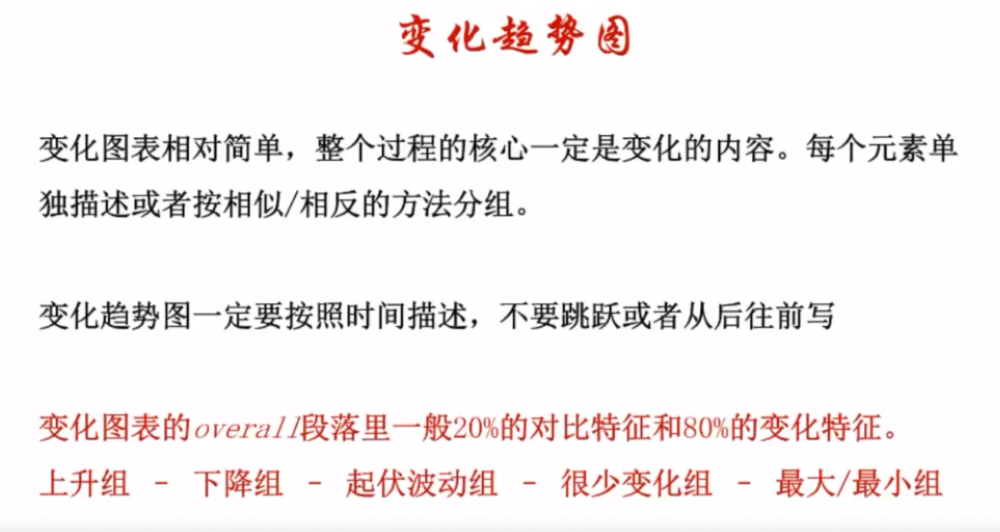

#### 示例

##### 示例 1

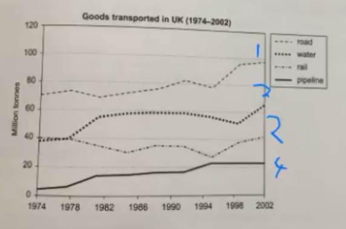

overall 段：

1. 124 总体上升，3 remained relatively constant/stable（保持相对稳定）；
2. 1 最高，4 最低。

> 注意：一定要分组对数据进行讨论，这里将 124 分为了上升组，3 分为了不变组。

##### 示例 2

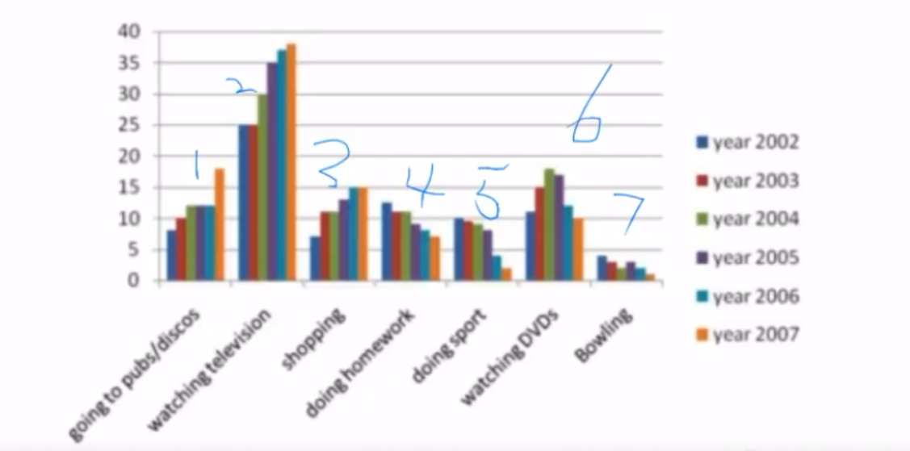

overall 段：

1. 123 上升，457 下降，6 起伏；
2. 2 一直最多，7 一直最少。

##### 示例 3

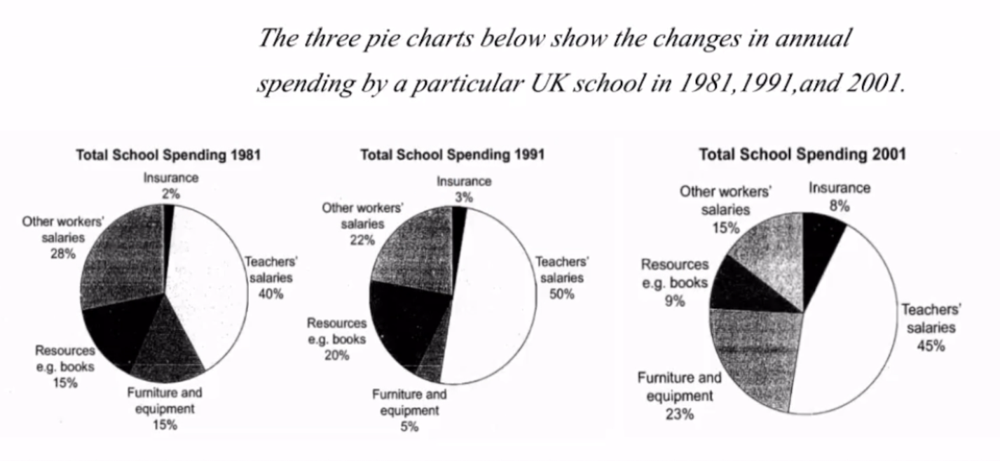

overall 段：

1. insurance 和 furniture 总体上升，workers 和 resources 总体下降，teachers 总体保持不变；
2. ……。

## 第八课

### 写作练习

#### 题目 1

Some people believe children should have organized activities in their free time. Others believe children should decide what to do in their free time on their own. Discuss both sides and give your opinion.

分析：

A 观点和 B 观点可以共存，两者都可以有。

#### 题目 2

变异题目：尽管科技很发达，但是人们还是很重视艺术家，比如画家、音乐家和作家。你认为有哪些关于 life 的东西是艺术能告诉我们但是科技不能做到的？

分析：

1. the meaning of life；
2. allow people to experience different lives - cherish；
3. teach people to deal with different situations in life。

> 注意：平时可以多积累写作素材，记一些经典电影、音乐和画作的名字。

#### 题目 3

人们获得的信息大多来自记者的报道。你认为在何种程度上记者应该被信任？好的记者应该有哪些 qualities？

分析：

可以写 4 段。

#### 题目 4

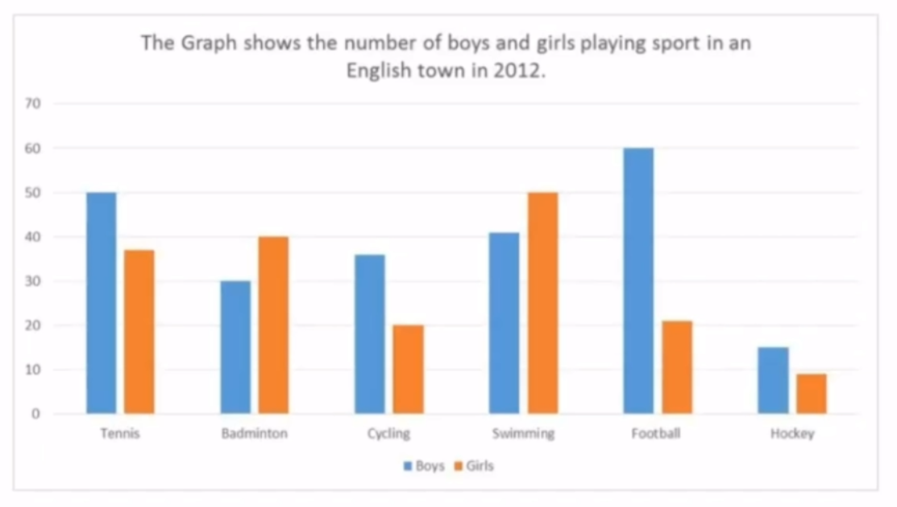

对比图（两者对比）：

1. Overall，参加运动的男生人数总体大于女生人数；
2. 最大的差距能够被看到在 football 的男女生人数上，而 hockey 体现了最小的差距。

```
Overall, the number of boys taking(主动用ing) part in sports was(描述用过去时) greater than that of girls.
The biggest gap could be seen in the number of boys and girls playing football, while hockey showed the smallest gap.
```

接下来，针对每一项运动，具体展开进行描述（谁多谁少，人数是多少）。

#### 题目 5

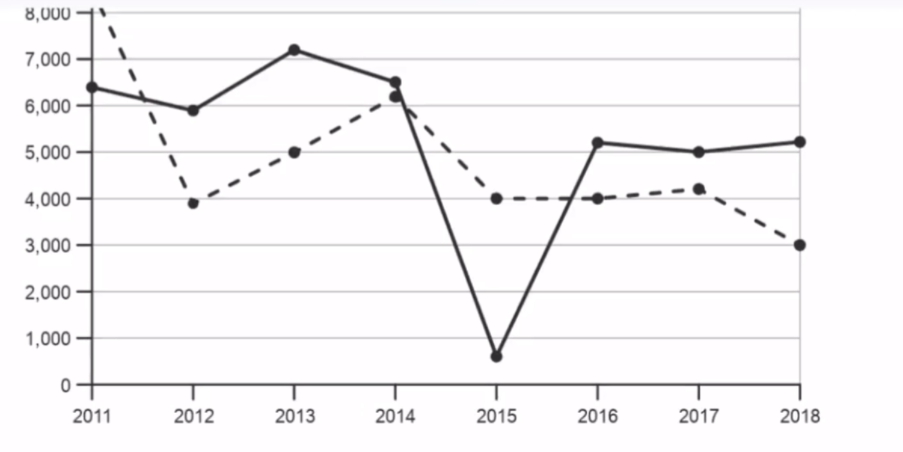

变化图：

1. 实线基本不变（保持稳定），with the exception of 2015 年；
2. 虚线整体下降。

范文：

```
The line graph shows trends in shop closures and openings of new shops in a particular country between the year 2011 and 2018.

Overall, the number of shop closures remained relatively stable/constant (with the exception of 2015).
In contrast, new shop openning showed a wider range of figures, but generally indicated/saw a downward trend over the same period.

In 2011, approximately 6,400 shops closed. The number of closures fluctuated over the next four years until 2015, when there was a dramatic fall in closures to roughly 700 shops. The following year the number of shops closing their doors rose sharply, reaching over 5,000. The figures remained steady for the next two years, with just over 5,000 closures in 2018.

The number of new shops opening decreased dramatically between 2011 (approximately 8,500) and 2012 (just under 4,000) but rebounded by roughly 50% by 2014. In 2015, the number of openings then fell to the 2012 level, but remained stable for the next two years. The last recorded year, 2018, saw a further(进一步的) fall to 3,000 new openings, the lowest point in this seven-year period.
```

> 注意：表示数字时，数字小于等于 10 一般用英文单词，大于 10 直接用数字。

#### 题目 6

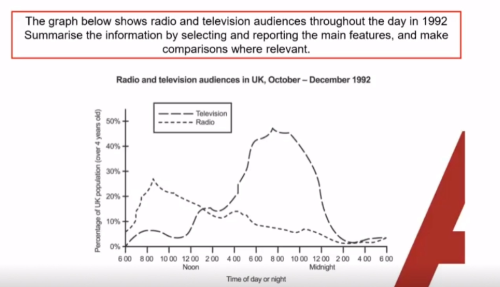

变化图 overall 段：

```
Overall, more people tended to listen to radio in the morning, while the popularity of watching TV was significantly greater in the afternoon and evening. People tended to do neither in the night and early morning.
```

#### 题目 7

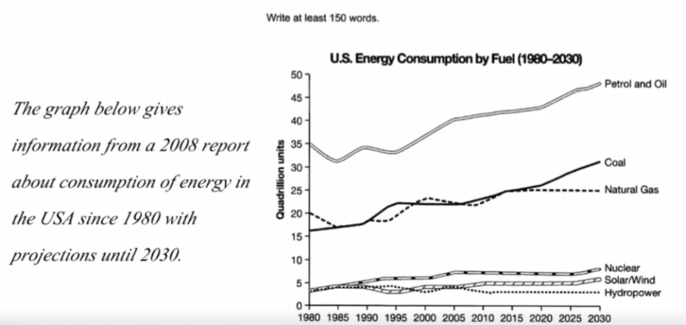

> 注意：时态，2030 年的数据应该用将来时进行描述。

### 变化图表 - 好词好句

#### 描述变化的句型

1. 主语 + 动词 + 副词；
2. 主语 + saw + a/an + 形容词 + 名词；
3. There was a/an + 形容词 + 名称 + in ……；
4. 特征 could be seen in ……。

> 注意：四种句型可以互相切换使用。

#### 分词做定语

```
The proportion of older people increased dramatically over the two decades, rising from 7% in 1995 to 40% in 2015.

The expenditure on food almost doubled, reaching approximately 30% of the total cost.
```

#### 表达“然后”

1. 句子 and then 句子；
2. 句子，after which 句子；
3. 句子 before doing ……。

#### 示例

```
Expenditure on resources such as books had increased to 20% by(截至) 1991 before(然后) decreasing to only 9% by the end of the period.
In contrast, the cost of furniture and equipment saw an opposite trend. This cost decreased to only 5% of total expenditure in 1991 but(然后) rose dramatically in 2001 when it represented 23% of the school budget.
Similarly, the cost of insurance saw a rising trend, growing from only 2% to 8% by 2001.
```

```
In all three years, the greatest expenditure was on(could be seen in) staff salaries.
```

### 混合图表题

#### 出题方式

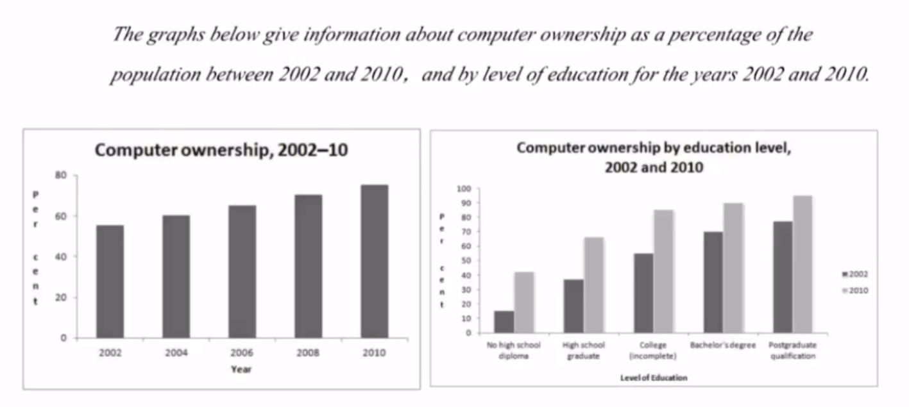

#### 审题思路

1. 两个图表分开写；
2. 同样需要 overall。

#### 写作结构

1. 改写；
2. Overall，两个图表的各自特征和共同特征；
3. 数据扩展第一个图表；
4. 数据扩展第二个图表。

#### 示例

overall 段：计算机拥有者比率一直在增加，越高学历的人计算机的拥有比率越高。

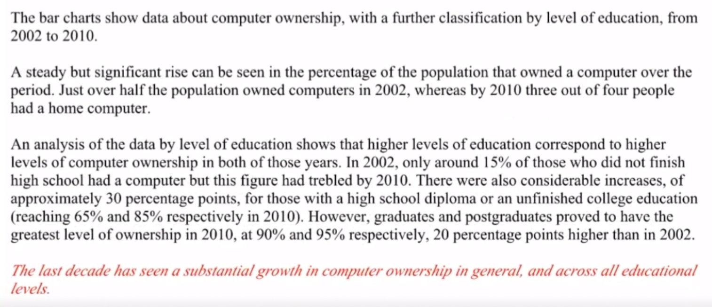

### 流程题

#### 出题方式

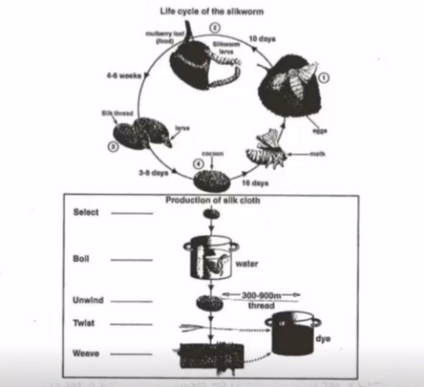

#### 写作结构

1. 改写；
2. Overall，…… 的流程共有 5 步，其中第 4 步又可以分为 5 步；
3. 展开具体描述每一步（first，second，……）。

> 特点：写作结构很简单，难点在于单词可能不认识。

### 地图题

#### 出题方式

……

#### 写作结构

……
