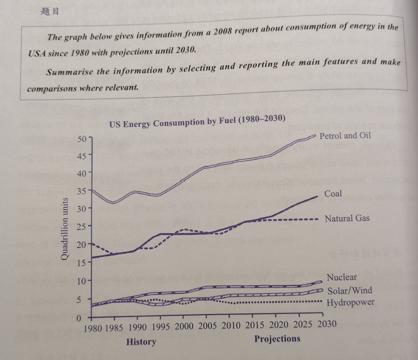
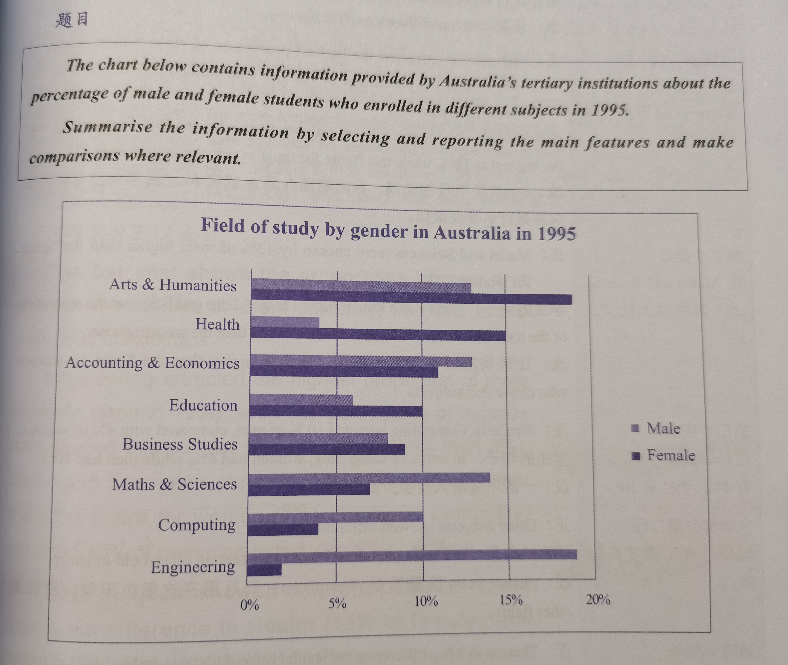
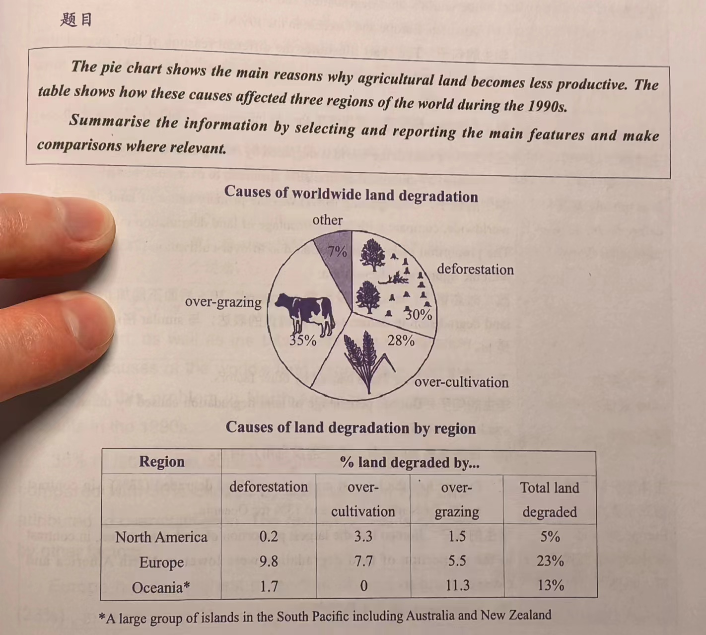

# 写作练习 - 小作文

## 动态图（变化图）

### 线图

#### 题目

#### 正文

This line graph illustrate the changes in the figure for commodities carried by four means of transportation in the UK during a period from 1974 to 2002.

Overall, an noticeable increase can be seen in the quantities of products transported by the road, the water and the pipeline, while the quantities of items sent by the rail has remained a stable trend, with two lowest point at around 1985 and 1995. In addition, road is the most popular way to carry things in the UK before 2002, while pipeline is the least-used transportation.

With regards to the road, it is the dominant means of transportation, with around 70 million tonnes of commodities shipped through this way in 1974, rising to around 100 million tonnes in 2002. Meanwhile, the water can be the second popular transportation during the twenty-eight-year period, and the figure for goods posted by this way are between 40 and 60 million tonnes approximately.

By comparison, the pipeline shows the lowest quantities which are no higher than 25 million tonnes until 2002. Moreover, the figure for products transported by rail remained the middle level among these means, fluctuating between 20 and 40 million tonnes.

#### 批改意见

> 得分：6 分。

##### TA

- 在 overall 段不要描述具体的细节（数据），只需要描述宏观的特征。

##### CC

- ..., rising to ... -> ..., and it continuously rose to ...，主体段需要描述数据的细节；
- ... are between 40 and 60 million tonnes -> remained stable in 1974 and 1978 at 40 and it increased to approximately 60 million tonnes at the end of the period，主体段需要描述数据的细节。

##### LR

- the quantities of ..., while (the quantities -> that) of ...，合理使用 that of 或 that which，避免重复描述同一个名词；
- 商品/货物：goods、commodities、products、items、cargos；
- before 2002 (最后一个时间点) -> throughout the period；
- 运输：transportation、carriage、transport、carry、send、ship、post；
- 数量：quantity、figure、number、data。

##### GRA

- (This -> The) line graph ...，介绍段第一句没有前文可以指代，不能用代词 this；
- ... graph illustrates ...，用一般现在时，动词加 s；
- (during a period -> 去掉) from 1974 to 2002；
- has remained a stable trend -> remained stable，语法要精简；
- ... (is -> was) ...，描述过去时间的数据，动词要用一般过去时；
- between 40 and 60 -> ... at 40 and ... at 60，描述数量，使用 at + 数字；
- 60 million tonnes approximately -> approximately/around 60 million tonnes，副词（如：“大约”）要放在数字前面；
- ... (until -> in) 2002，使用 in 描述数字所属的时间、地点以及类别。

### 线图 - 有预测值

#### 题目

#### 正文

The line graph illustrates changes in the cost of six different powers used by the USA from 1980 to 2008, and predicts that in the future until 2030.

Overall, a noticeable growth was seen in the spending of petrol/oil, coal, natural gas, nuclear, and solar/wind, and then this trend will continue in the next few years. By contrast, consumption of hydropower fluctuated over the past years before 2008, after which it will remain stable in the future until 2030. Moreover, petrol/oil has been becoming the highest waste of energy throughout the period, while the lowest was hydropower.

With regards to petrol/oil, the cost of it dropped in 1985 and 1995 at approximately 33 quadrillion units twice, and then it has been climbing significantly until 2030 at around 50. Similarly, that of coal has been rising from 1980 at 20 quadrillion units to 2030 at around 30. In addition, that of natural gas increased gradually from 1980 at over 15 quadrillion units to 2013, before remaining virtually unchanged at around 25.

As for nuclear and solar/wind, there were similarly upward trends in the consumption of them, with around 3 quadrillion in 1980 used in the USA, rising at aroung 6 in 2030. By comparison, the cost of hydropower has been remaining stable at approximately 3 quadrillion units throughout the period.

#### 批改意见

> 得分：6 分。

##### TA

- Overview 段过长（69 词），应该适当精简，可以只描述 1-2 个主要的特征；
- 数字后面的单位不能省略。

##### CC

……

##### LR

- six different (powers -> types of energy)；
- the (lowest -> least) one，注意分清楚是“最低的”还是“最少的”。

##### GRA

- ... (has been becoming -> was predicted to still be) the most used energy until 2030，描述未来的数据要注意时态，可以用一般将来时，也可以站在过去用一般过去时进行预测（was predicted to ...），不要用现在完成进行时（have been doing）；
- dropped (at -> to) 33，to 代表动作的指向；
- (has been climbing -> will reach) around 50 in 2030，描述未来的数据要注意时态；
- was rising from 1980 at 20 q to ... -> was rising from 20 q in 1980 to almost 25 q in 2008, and it was projected to continue going up until 2030, ending at around 30 q，描述数据的细节，不是 `from [年份] at [数字] to [年份] at [数字]`，而是 `from [数字] in [年份] to [数字] in [年份]`；描写未来的数据，可以站在过去用一般过去时进行预测（was projected to ...）；
- ... increased, (from 1980 at 15 q -> starting/beginning at 15 q (and ending at ... in ...) ), before remaining virtually unchanged at 25；
- (has been remaining -> remained) stable at ... (throughout the period -> since 1980 (起始时间) )。

## 静态图（对比图）

### 柱状图 - 男女差异

#### 题目

#### 正文

The bar chart compares the proportion of Australian boys majoring in eight categories of specialty with that of Australian girls in 1995.

Overall, the percentage of men who chose to study Engineering, Maths & Sciences, Computing and Accounting & Economics was much higher than that of women, while Arts & Humanities, Health, Education and Business studies were more popular within girls. Moreover, Engineering was boys' favorite subject, whereas that of female students was Arts & Humanities.

With regards to Engineering, the proportion of male learners who studied it was approximately nine times higher than that of females, with around 18% of boys enrolled in it, while the data of girls was dramaticly low at around 2%. In addition, Maths & Sciences were the second popular subjects within the men in school (14%), while the percentage of women learning it (7%) was half of that of men. Similarly, Computing and Accounting & Economics were also more popular within boys than girls.

As for Arts & Humanities, it were the female students' favorite, with around 19% of girls studying them, which was obviously higher than the percentage of boys (13%). Moreover, there was a dramatic gap between the proportion of the men majoring in Health and that of female, and the percentage of female people was (15%) over three times as high as that of male people (4%). Similarly, Education and Business Studies were more popular between girls compared with boys.

#### 批改意见

> 得分：6 分。

##### TA

- Overview 段过长（50 词），不需要列举所有的特征，只需要描述 1-2 个主要的特征。

##### CC

- Cohesive Devices：With regard to, In addition, Similarly。

##### LR

- dramaticly -> dramatically，拼写错误；
- around -> about/approximately，不要一直使用同一个单词，要换着使用；
- ..., with around 18% (of boys enrolled in it -> 无)，描述要精简，不要过于冗余。

##### GRA

- The bar chart compares the proportion of (Australian boys majoring in eight categories of specialty with that of Australian girls -> male and female students who enrolled in a variety of subjects according to Australia's high education) in 1995，需要说明数据的来源（Australia's high education）；
- A and B were also more popular within boys (than girls -> with 10% and 13%, whereas girls were at only 4% and 11%, respectively)，respectively：分别地；
- there was a dramatic gap between the proportion of the men majoring in Health and that of female, (and the percentage of female people was (15%) over three times as high as that of male people (4%) -> with 4% and 15%, respectively)，要精简，可以只罗列数据的细节；
- (无 -> The leftovers are) A and B (were more popular between girls compared with boys -> where there were 10% and 9% of females, while only 6% and 8% of males)，leftovers：剩余的。

### 饼图 - 多图

#### 题目

#### 正文

The pie chart compares different types of reasons leading to land degradation in the world, and the table presents the information about the proportion of a variety of causes of degradation in three countries in 1990s.

Overall, over-gazing is the most significant reason of land degradation in the earth, and the degree of degradation in the Europe was much higher than that of any other countries in this table.

In the first chart, the percentage of over-gazing is the highest (35%), while that of over-cultivation and deforestation are a little bit lower (28% and 30% respectively). By comparison, the other causes are less important than the formers (7%).

As shown in the second chart, 23% of land degraded in the Europe, which was much higher than that of the North America and the Oceania, 5% and 13%, respectively. In addition, the proportion of deforestation and over-cultivation in the Europe was also the highest (9.8% and 7.7%), while the lowest was 0.2% and 0%, in the North America and The Oceania respectively. In contrast, the highest percentage of over-gazing was in the Oceania (around 11%), which was twice as high as that of the Europe (5.5%).

#### 批改意见

> 得分：6.5 分。

##### TA

- Overall 段不仅需要写对比对象中的最高者（如：最高的是哪个国家），还要写同一个对比对象中最高的描述对象（如：同一个国家中最高的是哪一项）。

##### CC

- (As shown) in the first/second chart -> (to begin with)/furthermore，不要直接写“在哪张图中……”。

##### LR

- 原因：reason、factor；
- 影响：cause、impact；
- 国家：region、country、area；
- 分别：respectively、separately；
- ... (in this table -> 去掉)，多余。

##### GRA

- different types of reasons leading to -> the different factors of，reason 后面应该接 for；
- in (the -> 去掉) Europe，只有以 United/Republic of/Kindom of 开头的国家名称前才加 the，如：the United States；
- ... was (much -> 去掉) higher than ...；
- ..., (无 -> at) 5% and 13%；
- ... was twice as high as that (of the -> in) Europe。

#### 范文参考

**1st body paragraph: details for the pie chart**

When it comes to the factors why land was deteriorated, this is mainly because of over-gazing, which accounts for 35%, and this is followed by that for over- cultivation at 28%. Moreover, 30% was due to deforestation, while the lowest is for the proportion for other factors, with 7%.

**2nd body paragraph: details for the table**

In terms of the proportion of land that was degraded in the three regions, it can be seen that Europe was mostly affected by those factors, which accounted for 23% of its total and most of it was due to deforestation with 9.8%. However, the percentage of land that was degraded in Oceania was 13%, which was constituted by 11.3% that was destroyed by over-grazing and 1.7% was by deforestation. What is more, there was no record of over-cultivation existing in Oceania, but it was the main reason for land deterioration in North America, constituting 3.3% of the total land deteriorated(5%).

## 流程图

……

## 地图

……
