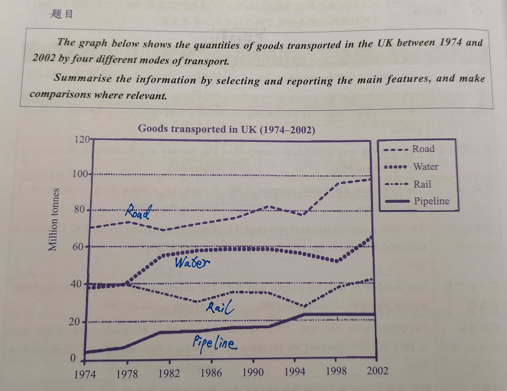

# 写作练习 - 小作文

## 变化图（动态图）

### 线图

#### 题目

#### 正文

This line graph illustrate the changes in the figure for commodities carried by four means of transportation in the UK during a period from 1974 to 2002.

Overall, an noticeable increase can be seen in the quantities of products transported by the road, the water and the pipeline, while the quantities of items sent by the rail has remained a stable trend, with two lowest point at around 1985 and 1995. In addition, road is the most popular way to carry things in the UK before 2002, while pipeline is the least-used transportation.

With regards to the road, it is the dominant means of transportation, with around 70 million tonnes of commodities shipped through this way in 1974, rising to around 100 million tonnes in 2002. Meanwhile, the water can be the second popular transportation during the twenty-eight-year period, and the figure for goods posted by this way are between 40 and 60 million tonnes approximately.

By comparison, the pipeline shows the lowest quantities which are no higher than 25 million tonnes until 2002. Moreover, the figure for products transported by rail remained the middle level among these means, fluctuating between 20 and 40 million tonnes.

#### 批改意见

……

## 对比图（静态图）

## 流程图

## 地图