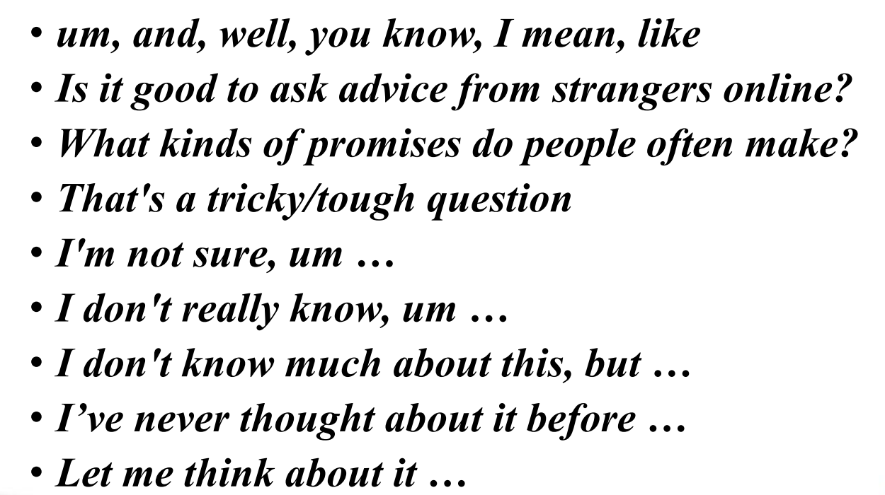
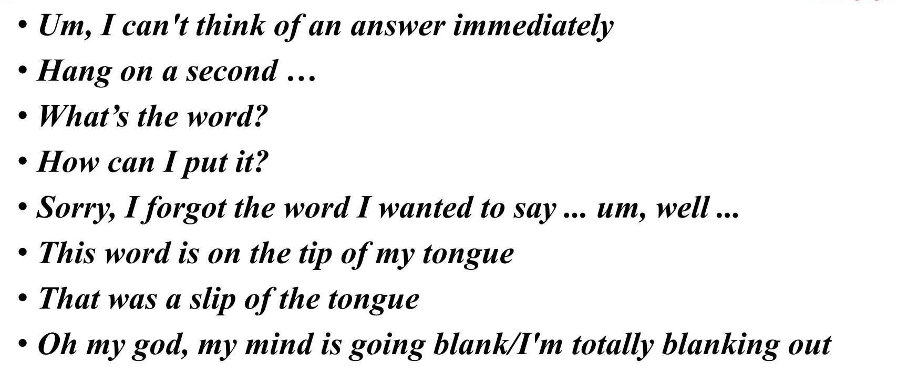

# 雅思口语 - 课程笔记

## 第一课

### 概述

考察你的 first reaction。不要刻意去网上搜一些比较学术的回答，如果自己本来就不知道，就不要强行去想，会导致说得很不流畅。

沟通是关键。说什么都是对的，关键是要说出来，思考的时候也必须要说话，不要一直闷头思考不出声。

part 1 和 part 2 的题目是有范围的（相对固定），而 part 3 的题目是考官现场临时想出来的，为了考验考生的真实水平，而不是背答案。

### 评分标准

- Fluency and Coherence（FC）；
- Lexical resource（LR）；
- Grammatical range and accuracy（GRA）；
- Pronunciation（P）。

> 注意：口语的要求中并不包含 Task Response（TR），即并不要求必须回应题目的要求，而是言之有理即可。

不能只提升某一个评分标准，而是要综合学习。因为只提高某一项的分数，很可能最后平均以后的总分数并没有变化，从而无法获得正反馈。

最重要的是 Coherence。

> 学习资料：【雅思口语评分标准解析】视频，每周看一遍。

### 方法论

#### 概述

- Paraphrasing（转述，将一个词扩展为一个段，重点是要把事情说清楚）；
- Whatever's going through your mind（将脑子中的第一反应说出来，不一定要说具有实际意义的内容）。

#### 填充句

填充句：当想不起词或不知道说什么而卡壳时，可以说填充句用于过渡（将思考的过程说出来）。

示例：What's that phrase again ?（那个词是什么来着？）

⭐ 常用填充句：





> 注意：以上句子都要熟记，要变成自己下意识的反应（每天早晨朗读 & 背诵）。

#### 扩展公式

1. 观点；
2. 原因；
3. 具体；
4. 过去/现在。

> 注意：Make it personal；能扩展则充分扩展，不能扩展则自信停下。

示例：


> 注意：这道题是 part 1 的题目，不需要说很多，两三句话就差不多了。但是如果确实有的说，也可以多说，但不一定会加分，加不加分只取决于你的表达水平。说的多有可能会被考官打断，被打断不是因为自己说的不好，而是考官需要控制时长。

#### 开头句

```
Yeah, definitely/absolutely（当然）
No, definitely/absolutely not（当然不）

Yeah, I do like/enjoy ...（do强调语气）

Not really（我不太……，语气比较缓和）

I think/suppose/guess
I believe
In my opinion/view
错误用法：In my opinion, I think ...（重复了）

Yes, I think/suppose/guess so
No, I don't think so
```

### 作业

- 课堂作业：熟练背诵方法论（除题目和示例以外）；
- 每周作业：【雅思口语评分标准解析】视频，每周看一次；
- 每日作业（长期）：
  1. 素材积累：背诵、听、跟读 part 1 和 part 2 口语素材；
  2. 发音练习：每日背三句，模仿发音（注意发音现象的细节），每个句子朗读 50 遍以上；
  3. 培养语感：背诵 99 句，跟读录音，模仿发音，然后自己单独朗读每个句子 20 遍，读完以后再开始去背。