# 雅思口语 - 课程笔记

## 第一课

### 概述

考察你的 first reaction。不要刻意去网上搜一些比较学术的回答，如果自己本来就不知道，就不要强行去想，会导致说得很不流畅。

沟通是关键。说什么都是对的，关键是要说出来，思考的时候也必须要说话，不要一直闷头思考不出声。

Part 1 和 Part 2 的题目是有范围的（相对固定），而 Part 3 的题目是考官现场临时想出来的，为了考验考生的真实水平，而不是背答案。

> 注意：
>
> - Part 2 = Part 1 * 4；
> - Part 3 = longer Part 1。

### 评分标准

- Fluency and Coherence（FC）；
- Lexical resource（LR）；
- Grammatical range and accuracy（GRA）；
- Pronunciation（Pro）。

> 注意：口语的要求中并不包含 Task Response（TR），即并不要求必须回应题目的要求，而是言之有理即可。

不能只提升某一个评分标准，而是要综合学习。因为只提高某一项的分数，很可能最后平均以后的总分数并没有变化，从而无法获得正反馈。

最重要的是 Coherence。

> 学习资料：【雅思口语评分标准解析】视频，每周看一遍。

### 方法论

#### 概述

- Paraphrasing（转述，将一个词扩展为一个段，重点是要把事情说清楚）；
- Whatever's going through your mind（将脑子中的第一反应说出来，不一定要说具有实际意义的内容）。

#### 填充句

填充句：当想不起词或不知道说什么而卡壳时，可以说填充句用于过渡（将思考的过程说出来）。

示例：What's that phrase again ?（那个词是什么来着？）

⭐ 常用填充句：

```
um, and, well, you know, I mean, like
Is it good to ask advice from strangers online?
What kinds of promises do people often make?
That's a tricky/tough question
I'm not sure, um ...
I don't really know, um ...
I don't know much about this, but ...
I've never thought about it before ...
Let me think about it ...
Um, I can't think of an answer immediately
Hang on a second ...
What's the word?
How can I put it?
Sorry, I forgot the word I wanted to say ... um, well ...
This word is on the tip of my tongue
That was a slip of the tongue
Oh my god, my mind is going blank
Oh my god, I'm totally blanking out
```

> 注意：以上句子都要熟记，要变成自己下意识的反应（每天早晨朗读 & 背诵）。

#### 扩展公式

1. 观点；
2. 原因；
3. 具体；
4. 过去/现在。

> 注意：Make it personal；能扩展则充分扩展，不能扩展则自信停下。

示例：


> 注意：这道题是 part 1 的题目，不需要说很多，两三句话就差不多了。但是如果确实有的说，也可以多说，但不一定会加分，加不加分只取决于你的表达水平。说的多有可能会被考官打断，被打断不是因为自己说的不好，而是考官需要控制时长。

#### 开头句

```
Yeah, definitely/absolutely（当然）
No, definitely/absolutely not（当然不）

Yeah, I do like/enjoy ...（do强调语气）

Not really（我不太……，语气比较缓和）

I think/suppose/guess
I believe
In my opinion/view
错误用法：In my opinion, I think ...（重复了）

Yes, I think/suppose/guess so
No, I don't think so
```

### 作业

- 课堂作业：熟练背诵方法论（除题目和示例以外）；
- 每周作业：【雅思口语评分标准解析】视频，每周看一次；
- 每日作业（长期）：
  1. 素材积累：背诵、听、跟读 part 1 和 part 2 口语素材；
  2. 发音练习：每日背三句，模仿发音（注意发音现象的细节），每个句子朗读 50 遍以上；
  3. 培养语感：背诵 99 句，跟读录音，模仿发音，然后自己单独朗读每个句子 20 遍，读完以后再开始去背。

## 第二课

### Part 3 练习

#### 朗读文章


#### 素材积累

```
misinformation（错误信息）
disinformation（误导信息）
fake news
mislead people

printed/physical book
printed map
online map
navigation apps（导航应用）
gaode/google/baidu maps

alertness（清醒、警觉）
melatonin（褪黑素）
secretion（分泌物）

electric（电的）
electronic（电子的）
```

#### 回忆检索

回想自己不熟悉的单词，短语。

#### 填空练习


### 扩展"观点"

#### 特殊开头句

It depends (on the 单数）：

1. If ... But if ...
2. Young people ... whereas（然而）elderly people ...

```
It depends on the situation
It depends on the personal/individual
It depends on the product
It depends on the festival/holiday（spring festival -> Chinese/lunar new year）
It depends on the region
It depends on the age/age group（children/kids、teenager：13-19岁、young adults、middle-aged people、old people/elderly people/senior citizens）

picky eater（挑食）sss
```

Most of the time ... But occasionally（偶尔）/from time to time/once in a while ...

Generally（一般来说）/By and large ...

```
咖啡：
Americano
Latte
Cappuccino
work at/from the cafe/coffee shop
```

> 注意：如果普通开头不熟，那么别练这些。

#### 练习

##### 练习 1


##### 练习 2

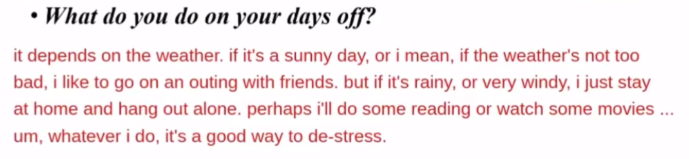

```
hang out 休闲地度过一些时间/做一些事
```

#### 结尾句

(So/Well/Um ...) yeah, ...(重复开头的观点).（降调）

> 注意：可以不要结尾句。

### 扩展"原因"

#### 扩展方法

- 原因比较抽象，通常不太好扩展，因此原因不要太长，要简洁一点；
- 不用每道题都给原因；
- 没有原因就描述具体：现象、表现、举例。

```
I don't know (why), but ...
I have no idea (why), but ...
There's no particular reason ... I/we just ...
This is pretty hard to explain ...
... so for example ...
```

#### 练习

##### 练习 1


##### 练习 2


##### 练习 3


## 第三课

### Part 3 练习 1

#### 朗读文章


#### 素材积累

```
traffic jam（可数）
traffic congestion（不可数，是一种现象）

combat/solve/resolve/tackle a problem

alleviate 缓解、减轻
city center 市中心
think twice 三思而后

practice 实践、行为
put sth into practice

be in place 到位
```

#### 回忆检索

回想自己不熟悉的单词，短语。

#### 填空练习


### Part 3 练习 2

#### 朗读文章


#### 素材积累

```
take up a form of exercise and reap(收获) a lot of benefits
form of exercise/relaxation/transportation

by far 最好的，而且比别的好很多
so far 目前为止

become more and more popular
have been gaining popularity in China

martial art 武术
kungfu 功夫

deep breathing 深呼吸

have various benefits
studies have shown that ...
live a healthy life/lifestyle

alleviate the symptoms of Parkinson's
```

#### 回忆检索

回想自己不熟悉的单词，短语。

#### 填空练习


### 扩展"具体"

#### 扩展方法

- 宽泛 -> 具体：缩小范围，越来越小、越来越细、越来越窄；
- 复数永远可以变成单数；
- 努力说到“更更具体”。

示例：


扩展时间：


复数变单数：

```
books -> 某一本书
```

”更更具体“：多说几步。

#### 素材积累

##### 常用表达

```
several = a few = a number of
many = a lot of = tons of = a large number of
various = a variety of = a wide range of
many kinds of = many types of

including + [n.]
such as + [n.]
like + [n.]/句子
for example/instance + 句子
and so on = and so forth

especially
particularly
in particular
to be specific
out of these, ... 
I particularly like ... 
my favorite is/would be ... 
if I had to pick a favorite, it would be ...（if had ..., would ... 这是虚拟语气）
in terms of/as for ...
```

##### 示例

```
aquarium 水族馆
marine animal, especially sharks
drink coffee, particularly black coffee
I often go travelling, particularly to seaside cities
I enjoy reading, especially novels
watch movies such as action movies and sci-fi(science fiction) movies
```

#### 练习

##### 练习 1


##### 练习 2


##### 练习 3


##### 练习 4


##### 练习 5

Is it easy for you to focus?

##### 练习 6

Do you think geography is useful?

##### 练习 7

What do you usually do with your friends?

### Part 2 练习


## 第四课

### Part 3 练习 1

#### 朗读文章


#### 素材积累

```
mess with
cause a variety of health issues
casue various health peoblems
eliminate

electric/battery-powered vehicles/cars
gas-powered/petrol-powered cars
carmaker
byd/haval
hybrid 混合动力

deal/cope with
you come across(偶然碰到) a problem, you deal with it, then you move on.
tons of measures to deal with environmental problems.
```

#### 回忆检索

回想自己不熟悉的单词，短语。

#### 填空练习


### Part 3 练习 2

#### 朗读文章

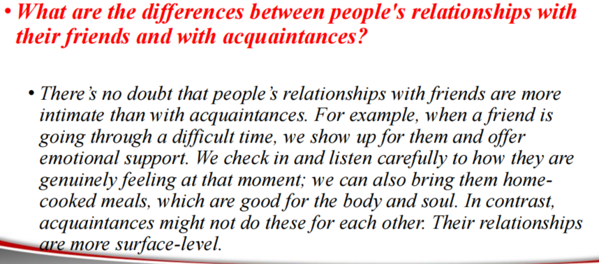

#### 素材积累

```
acquaintance 泛泛之交（认识的人，但是不熟）

There's no doubt that ...
close it / closer
intimate 亲密的

experience difficulties
obstacles
go through a tough/challenging time
tunnel 隧道
work out

show up for them
I will always be there for you

offer emotional support
rely on each other
have a shoulder to cry on
social animal
alone
feel lonely
loneliness is the cause of many health problems

check in 了解
check in on [sb.]
go through security check
genuine 真挚的
genuinely feeling 真实的想法
at that moment

home-cooked meals/food
put thought into [sth.]
put your heart and soul into that
eat out 出去吃饭

surface-level
```

#### 回忆检索

回想自己不熟悉的单词，短语。

#### 填空练习


### 扩展"过去/现在"

#### 扩展方法

- 主动谈论过去，证明观点/进行对比；
- 注意时态（描述过去，使用一般过去时）。

#### 素材积累

##### 证明观点

```
Like a couple of days ago/a few weeks ago/several years ago ... 
For example/instance, last weekend/month/summer ... 
Actually/In fact ... 
The last time I did [sth.] was ... 
I remember clearly/vividly(生动的、清晰的) that ...
```

##### 进行对比

题目是一般现在时，主动描述过去：

```
But/However
..., whereas ...
when I was younger/a kid/a child/in high school ...
back in the day, I mean, ... ago
I used to ...
I would always ...
I would ... every day/twice a week（我会做……，用于描述过去的习惯）
My life has changed a lot now/Things have changed a lot now
My life is very different now
```

关于过去的题目聊现在，进行对比/延续过去：

```
..., whereas now
..., but/however, these days
Things have changed a lot now
My life has changed a lot now
My life is really different now

... still the same
... haven’t/hasn’t changed at all
```

#### 练习

##### 练习 1 - 证明观点


##### 练习 2 - 证明观点


##### 练习 3 - 进行对比


##### 练习 4 - 进行对比


```
smoggy = smoke + fog 雾霾的
```

##### 练习 5 - 进行对比

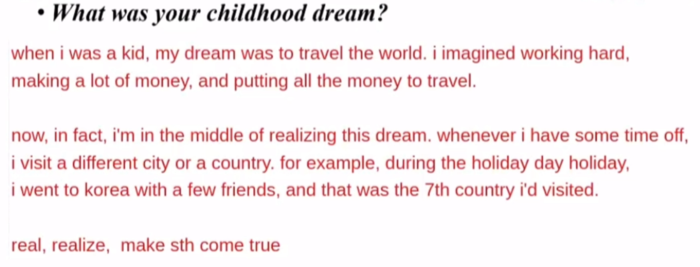

##### 练习 6 - 进行对比


##### 练习 7 - 进行对比

**Did you often watch films when you were a child?**

```
cartoon 动画片
animation / animated movie/film 动画电影

be busy with ...
```

##### 练习 8 - 进行对比

为现在再添加一个过去：


```
handyman
hop online 上网
```

### 注意事项

- 敢于自信停下；
- 事情的真假不重要；
- 逻辑要简单、不要太复杂。

### 作业

- 99 句超熟练背诵（时间、地点、人物）；
- 方法论超熟练背诵；
- Part 1 素材背诵词汇、影子跟读；
- Part 1 题库练习录音答题（不要提前想好要说什么，要直接开始说，即使没有答案也要能说出东西）；
- Part 3 练习反复朗读和背诵。

## 第五课

### Part 3 练习

#### 朗读文章

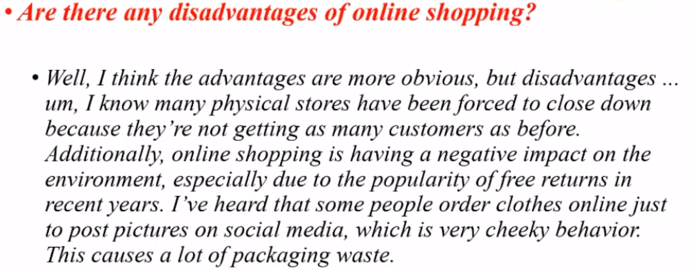

#### 素材积累

```
tend to be cheaper
travel to a physical store(实体店)
buy anything in the comfort of your own home
with the click of a mouse

close down 倒闭
close up 打烊

I've been running in recent years
I've been reading a lot in recent years
I've tried to visit many countries as possible in recent years
the popularity of skiing has been on the rise in recent years

influencer 网红

post pictures 发布照片
come across [sth.] 偶然遇到

before the pandemic(疫情)
before the advent(到来) of online shopping

cheeky(厚颜无耻的) behaviour
packaging waste 包装浪费
parcel/package 包裹
```

#### 回忆检索

回想自己不熟悉的单词，短语。

#### 填空练习

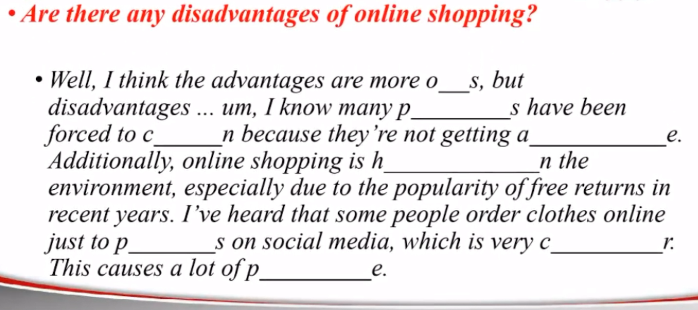

### Part 2 方法论

#### 概述

- 少关注“高分”词汇、语法；
- 关注整体结构清晰、单点充分扩展；
- 注意时态小错误（过去、三单、……）、注意 he/she；
- 做笔记（1 分钟，看题目，思考要说什么，很重要）。

> rounding off question（返场题目）：不用扩展、简要回答即可。

> 注意：Part 2 的哪个小点都可以多说，也可以少说，还可以不说；哪个小点好说就多说点；没说到的点可能会被当做 rounding off question 在最后被考官提问。

#### 回答结构

- 从上到下；
- 逐点回答；
- 单点扩展（能扩展则充分扩展，不能扩展则一带而过）；
- 不要串点（尽量）。

#### 单点扩展

- 观点；
- 原因；
- 具体；
- 过去/现在。

#### 做笔记

- 纸横着用；
- 先写上“观、原/具、过/现”；
- 不断地思考逻辑，而不是硬想内容（真真假假，可以编）；
- 笔记要简化，尽量是关键词的部分字母；
- 尽量写英文；
- 尽量 5 秒钟内决定说什么（不要反复想说什么话题），随便说什么都可以，可以通过逻辑去编内容；
- 做完笔记后，照着笔记念（可以保证流畅）。

示例：

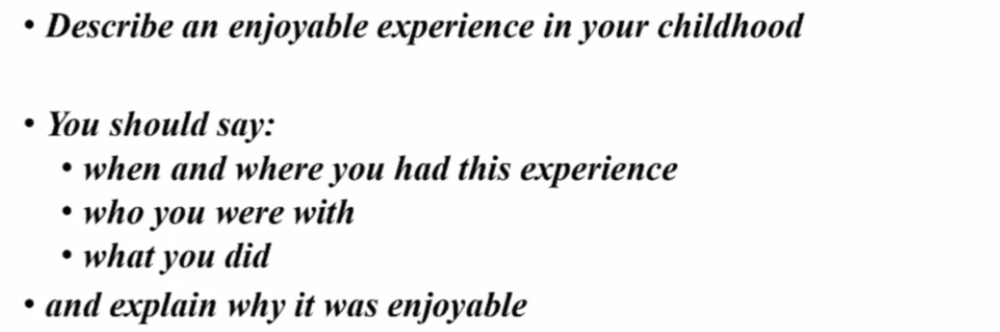

```
观、原/具、过/现

1.when?
观：8 
原/具：sum, jul, wkend, aft, picn, finis homew, cele
过/现：now, picn, occa, start

1.where?
观：park
原/具：flower, close, 10 min, like, oft, 2/3 ts, chos
过/现：X, mov, other

2.who?
观：fri
原/具：3, nei+classm, clos, thic(thick as thieves), toget, pic
过/现：X in tou(be in touch with [sb.]), call, back(get back in touch)

3.what?
观：pic
原/具：beau, sun, X wind, sandw, fri, good
过/现：...
```

> 注意：每个小观点不一定非得扩展这么多，可以扩展少一点。

#### 回答技巧

加入时间顺序，使描述更具有条理：

```
first, at first, right after ...
then, after that ...
at the same time, in the meantime, while (I was)/(we were) doing [sth.]
a while later, a moment later, ... later
in the end, at the end of ...
```

## 第六课

### Part 3 练习 1

#### 朗读文章

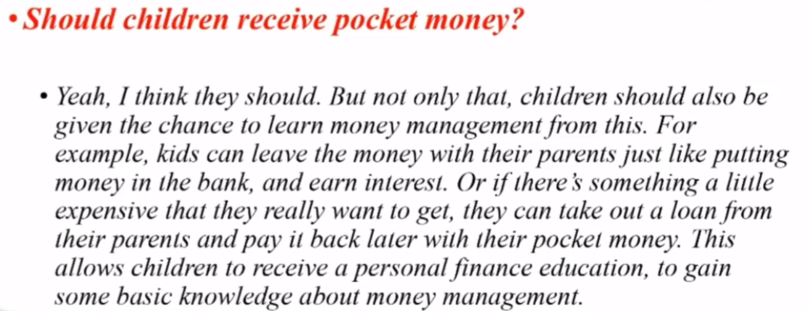

#### 素材积累

```
pocket money 零花钱
red envelope 红包

time management 时间管理
stress management 压力管理
de-stress
under so many stress

there's no doubt that children ...
socialize 社交

deposit/leave money 存钱
put money in the bank
earn interest 利息
invest in the stock market
buy insurance
take out a loan 借钱/贷款
take out 取出

receive a personal finance education
gain knowledge about money management
```

#### 回忆检索

回想自己不熟悉的单词，短语。

#### 填空练习

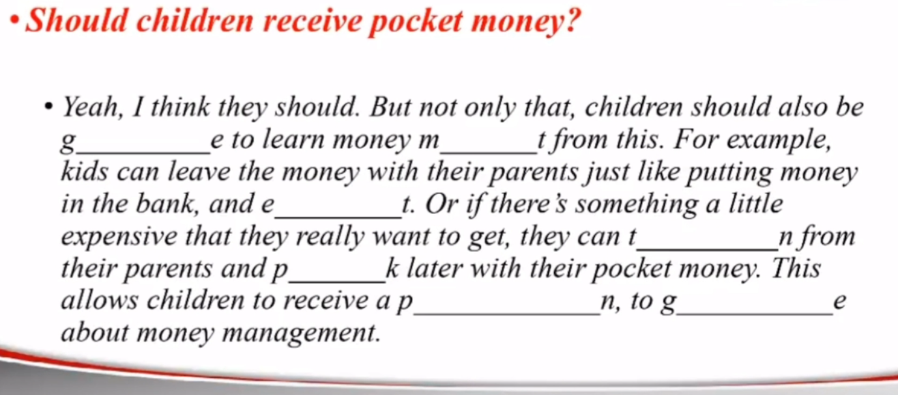

### Part 3 练习 2

#### 朗读文章

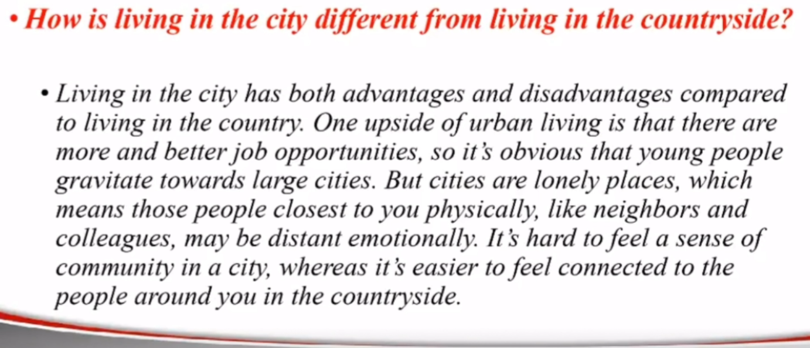

#### 素材积累

```
country = countryside 乡村
urban(adj.) 城市的
I live in an urban area
urb 城市
sub 下/子
subway 地铁
subconscious 潜意识
sub-urb 郊区
suburban 郊区的
rural 乡村的
I used to live in a rural area

upside 优点
downside = drawback/disadvantage 缺点

job opportunities

gravitate 被吸引
[sb.] gravitate towards ... 被吸引
gravity 重力
grave 严重的/坟墓

closest to you physically
be distant emotionally

feel a sense of community
feel connected to
```

#### 回忆检索

回想自己不熟悉的单词，短语。

#### 填空练习

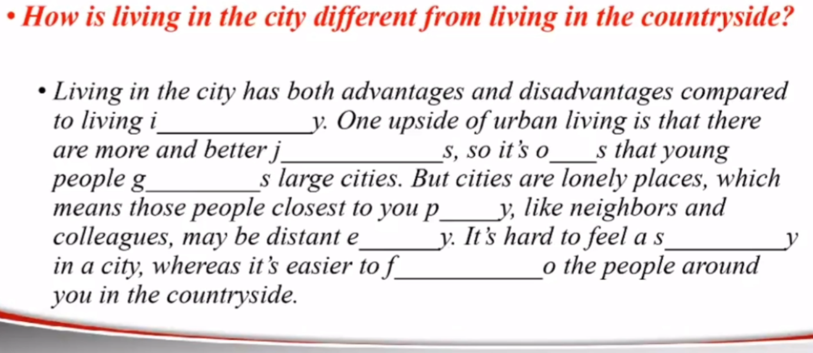

### Part 2 方法论

#### 全篇开头句

```
I'm going to (talk about)/describe + 答案（不要重复题目，直接给出答案）
The [题目] I'm going to (talk about)/describe is + 答案
```

我要描述那次/一次……的经历：

```
I'm going to (talk about)/describe a/the time when I did [sth.]
time = occasion = situation = experience
```

示例：

```
题目：
describe an occasion when you got up early?

开头一：
I'm going to describe a time when I got up at 4 am.

开头二：
I'm going to describe a time when I had to catch an early flight.
```

> 注意：开头第一句不要完全重复考官的问题，可以适当扩展细节，否则就是废话。

#### 扩展未来

只要没说够 2 分钟，需要多说一点，就可以扩展未来。

扩展较近的、有计划的未来：时间、地点、人物、事件、感受。

使用一般将来时，描述要具体。

```
Speaking of this, um, I'm going to ... tomorrow.
By the way, I will probably/(most likely) ... next month.
Oh, this reminds me, ... is (coming up)/(around the corner).
```

#### 注意事项

将 how you know 理解成 why you know。

示例：

```
I know him/her because three years ago, ...
```

#### 练习方法

- 做笔记、录音答题；
- 写回答、朗读、做笔记、录音答题。

## 第七课

### Part 3 练习 1

#### 朗读文章

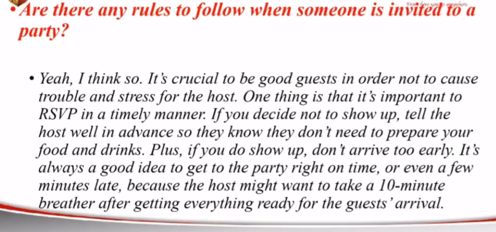

#### 素材积累

```
throw/hold/host a party 举办派对

a piece of clothing
suit/match my style

RSVP in a timely manner 及时回复

plan for the holiday in advance(提前)
... well in advance(尽可能早、提前)
Malaysia 马来西亚
below zero 零下
well below zero 低于零下好多

show-and-tell = give a presentation

It's always a good idea to ...
public speaking skills
take a break/breather 休息一下
need a rest
```

#### 回忆检索

回想自己不熟悉的单词，短语。

#### 填空练习

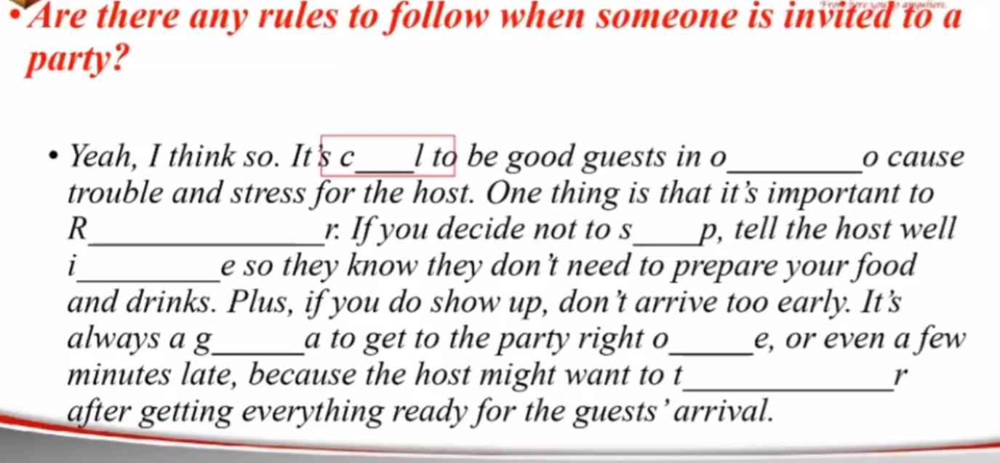

### Part 3 练习 2

#### 朗读文章

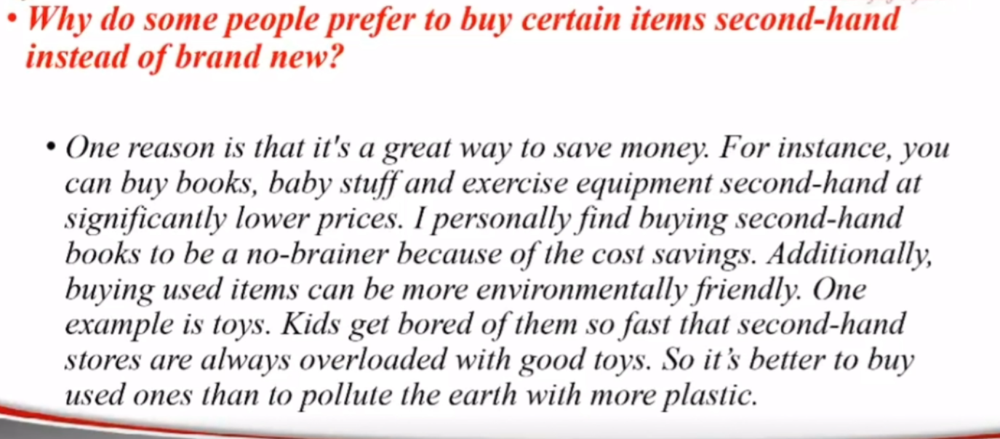

#### 素材积累

```
baby stuff 儿童用品
stroller/pram 婴儿车

no-brainer 无脑选

environmentally friendly
packaging waste
plastic pollution
```

#### 回忆检索

回想自己不熟悉的单词，短语。

#### 填空练习

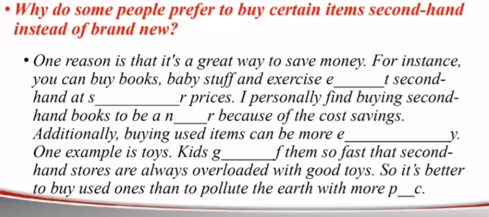

### Part 3 方法论

#### 题目类型

会问 1-2 个题目（可能会追问 4-5 个问题，这是 discuss 的一部分）。

题目类型：大众、社会、国家、世界、宇宙等抽象话题。

#### 回答逻辑

观点本身不重要，观点的数量也不重要。不要罗列观点，要扩展观点的细节。

- 有观点：顺着一个观点进行充分的扩展（观点/原因/具体：举例、细节、描述场景）；
- 无观点：……。

#### 练习

##### 练习 1

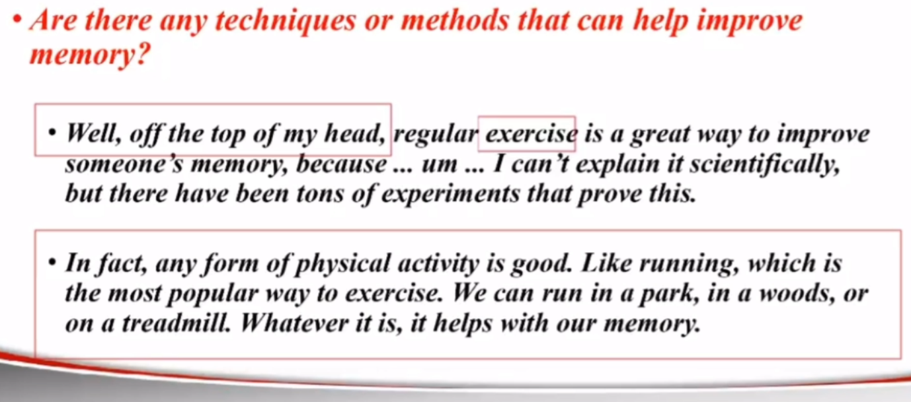

##### 练习 2

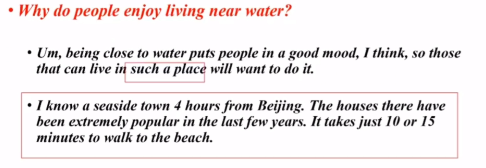

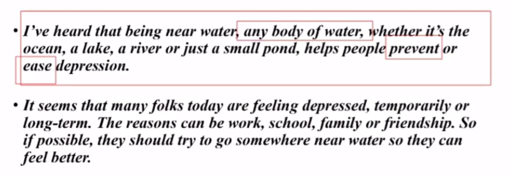

```
ease 缓解
```

#### 总结

可以给出 1-3 个观点（推荐 2 个）。

```
One thing is that ...
Plus, ...

One reason is that ...
Additionally, ...
```

##### 常用表达

```
总述：
a variety of ...
a wide range of ...
tons of ...
quite a few ...
several
a number of ...

首先：
for starters / first of all / firstly
one ... that I can think of is ...
the first ... that comes to (不要加my) mind is ...

其次：
plus / besides / also
in addition / what’s more / furthermore
```

##### 示例

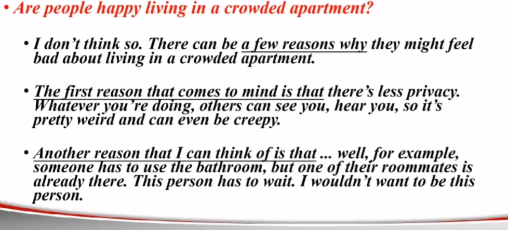

```
creepy 令人毛骨悚然的
```

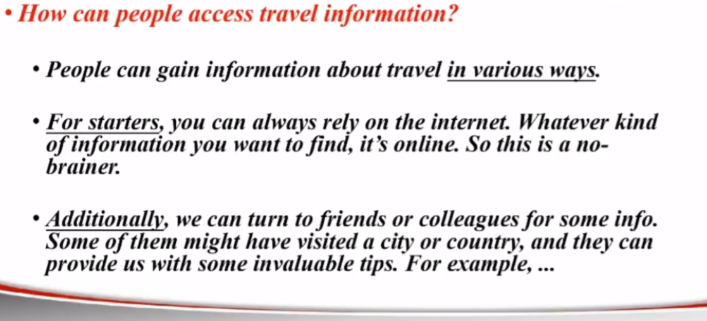

```
invaluable 宝贵的、有用的
```

## 第八课

### Part 3 练习 1

#### 朗读文章

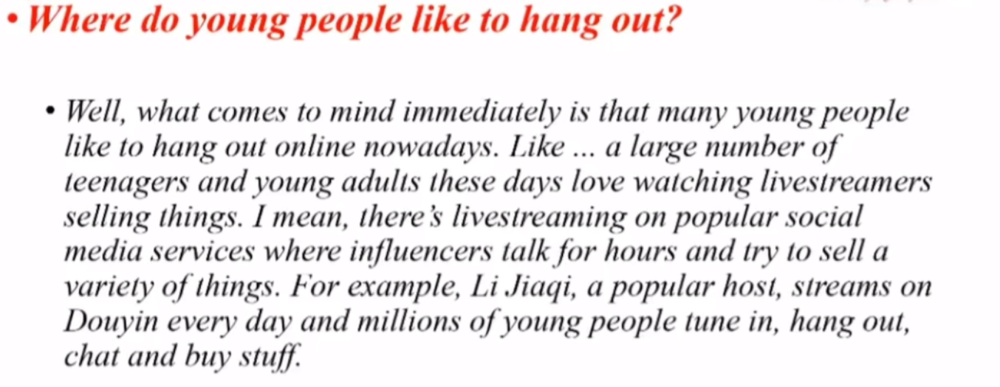

#### 素材积累

```
hang out 休闲地度过一些时间

what comes to mind

be addicted to social media
I got hooked on those videos about ...

a large/small number of ...

these days = nowadays

livestreamer 流媒体
I stream(上网) music/movies every day

social media/platforms
YouTube
influencers 网红

from dawn to dusk 从早到晚

tune in 收看/收听
```

#### 回忆检索

回想自己不熟悉的单词，短语。

#### 填空练习

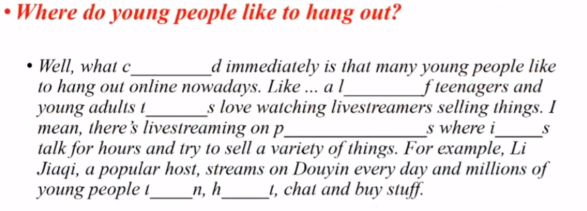

### Part 3 方法论

#### 无观点情况

只要第一反应没观点，就叫没观点。

解决方法：

ask the examiner to repeat or clarify the question.

```
I'm sorry? Excuse me?
Sorry, could you say it again please?
I'm sorry, would you please repeat the question?
What do you mean by ...?
I'm not sure what ... means. Could you explain it please?
```

示例：

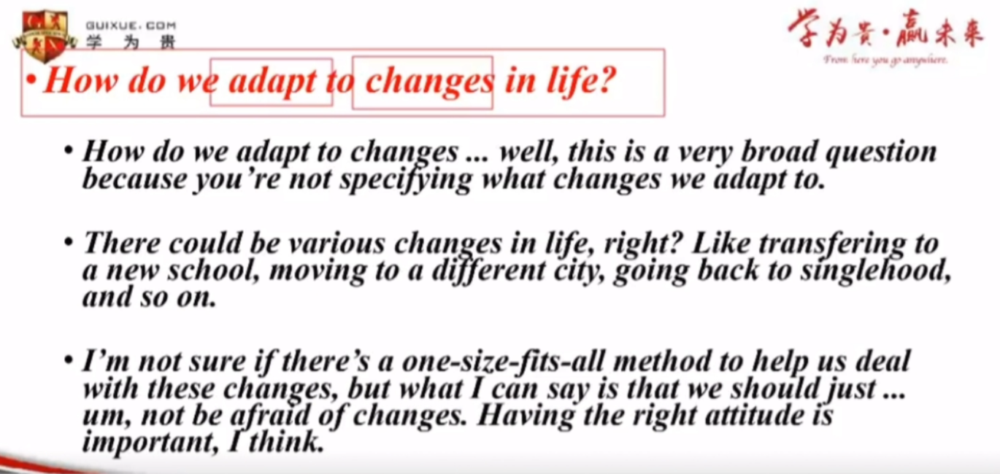

```
adapt 适应
broad 宽泛的
one-size-fits-all method 万金油方法

what do you mean by adapt?
```

filler sentences.

```
That's a tricky/tough question?
I'm not sure, um ...
I don't really know, um ...
I don't know much about this ...
I've never thought about it before ...
Um, I can't think of an answer immediately
```

focus on what you know.

```
filler sentences + why(because ...)
```

示例：

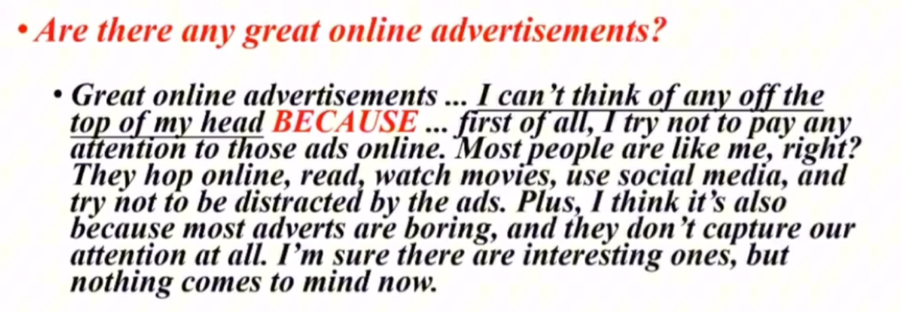

```
ad, advert, advertisement 广告
```

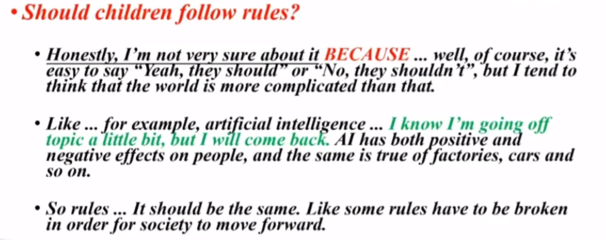

跑题时可以说：

```
I know I'm going off topic a little bit ...
I'm going off on a tangent here ...

..., but I'll come back
..., but I'll try to connect it back to your question
```

先谈论社会现象、举例，然后推导出观点：

```
as for .../in terms of .../when it comes to ...
what I can think of right now is/are ...
one ... that comes to mind is ...
one ... I can think of now is ...
nowadays; in this day and age
it’s true that ...
... is indeed a serious issue
many people are talking about ... on social media
I’ve read that ...
```

## 总结

### 课后复习

- 复习课件（最重要），方法论超熟练背诵（中文 + 英文）、理解并讲出来；
- 99 句超熟练背诵（学习句型、语感提高）；
- 每天背三句；
- Part 1/2 素材影子跟读 + 范例回答分析逻辑；
- 阅读文章 + Part 3 回答和填空练习。

### 练习答题

- Part 1：不要背答案，自己练习录音回答，听自己的回答、改错、提升；
- Part 2：不要背答案，可以直接录音回答，也可以把自己的答案写下来之后，再练习回答；
- Part 3：录音回答阅读文章逆推出来的题目。