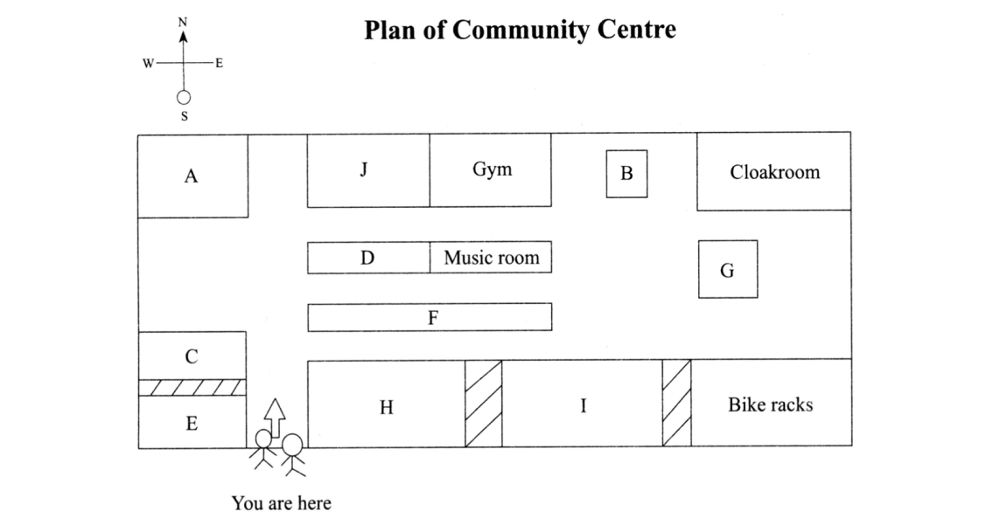
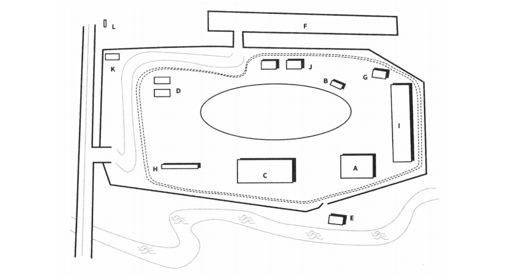
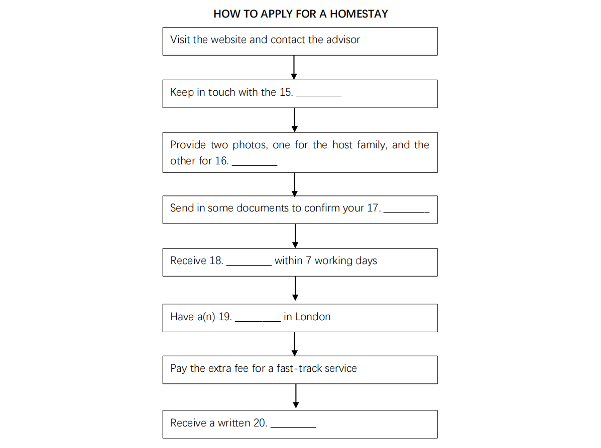
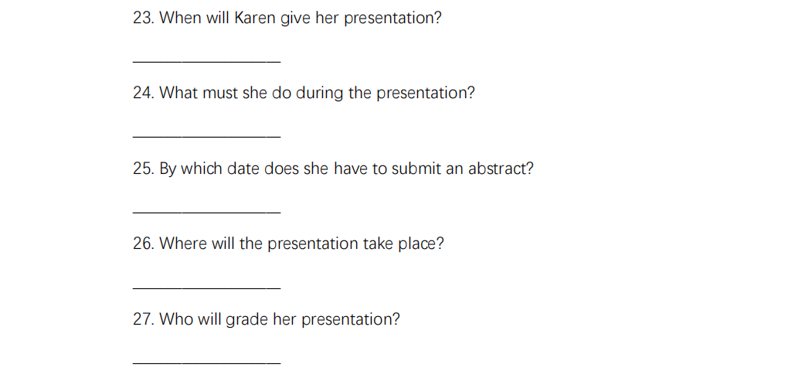
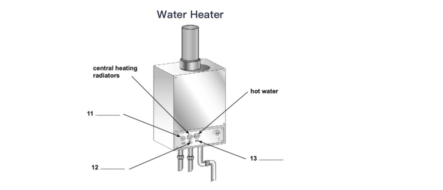

# 听力原文

## 【DAY 1-3】例题剑 7-2-4

My topic is handedness – whether in different sports it is better to be left- or right-sided or whether a more balanced approach is more successful. I’m left-handed myself and I actually didn’t see any relevance to my own life when I happened to start reading an article by a sports psychologist called Peter Matthews. He spent the first part of the article talking about handedness in music instead of sport, which I have to say almost put me off from reading further. But what I soon became struck by was the sheer volume of both observation and investigation he had done in many different sports and I felt persuaded that what he had to say would be of real interest. I think Matthews’ findings will be beneficial, not so much in helping sportspeople to work on their weaker side, but more that they can help them identify the most suitable strategies to use in a given game. Although most trainers know how important handedness is, at present they are rather reluctant to make use of the insights scientists like Matthews can give, which I think is rather short-sighted because focusing on individual flexibility is only part of the story.

Anyway, back to the article.

Matthews found a German study which looked at what he called ‘mixed-handedness’, that is, the capacity to use both left and right hands equally. It looked at mixed-handedness in 40musicians on a variety of instruments. Researchers examined a number of variables, e.g. type of instrument played, regularity of practice undertaken and length of time playing instrument… and found the following: keyboard players had high levels of mixed-handedness, whereas string players like cellists and violinists strongly favoured one hand. Also those who started younger were more mixed-handed.

Matthews also reports studies of handedness in apes. Apes get a large proportion of their food by ‘fishing’ ants from ant hills. The studies show that apes, like humans, show handedness – though for them right- and left-handedness is about equal, whereas about 85 percent of humans are right-handed. Studies showed that apes consistently using the same hand fished out 30 percent more ants than those varying between the two.

---

Matthews started researching several different sports and found different types of handedness in each. By the way, he uses ‘handedness’. to refer to the dominant side for feet and eyes as well as hands. Anyway, his team measured the hand, feet and eyes of 2,611 players and found that there were really three main types of laterality: mixed – you work equally well on both sides – both hand and eye; single – you tend to favour one side but both hand and eye favour the same side; and cross-laterality – a player’s hands and eyes favour only one side but they are opposite sides. Let’s start with hockey. Matthews found that it was best to be mixed-handed – this is because a hockey stick must be deployed in two directions – it would be a drawback to have hand or eye favouring one side. An interesting finding is that mixed-handed hockey players were significantly more confident than their single handed counterparts. Things are slightly different in racket sports like tennis. Here the important thing is to have the dominant hand and eye on the one side. This means that there is a bigger area of vision on the side where most of the action occurs. If a player is cross lateral the racket is invisible from the dominant eye for much of the swing, it means that they can only make corrections much later… and often the damage has been done by then.

And moving to a rather different type of sport which involves large but precise movements gymnastics. It’s been found that cross hand-eye favouring is best. The predominant reason for this is because it aids balance – which is of course absolutely central to performance in this sport.

## 【DAY 5.1】Part 1 填空题习题 1

**Employee:** Good afternoon. Welcome to Matrix Printing, I’m John Smith. How can I help you?

**Customer:** Good afternoon. I’m here to reprint a brochure for our hotel. There are some pages that need revising.

**Employee:** Sure, how may I address you?

**Customer:** Oh, I’m Mary Jane from Central Hotel Chains. Nice to meet you. I’ve got samples of the previous version.

**Employee:** I assume it is your company’s advertising brochure?

**Customer:** Yes.

**Employee:** What exactly is the problem?

**Customer:** Well, it was printed the year before, so some of the information is already out-of-date. There are also a couple of problems with the layout. Firstly, the letters of the address on the front page are far too small. It’s hard to see when glancing at the cover.

**Employee:** How big do you need it to be?

**Customer:** Increase the letters by 3 font sizes.

**Employee:** Just a minute. Let me take notes of your requirements…OK, what else needs changing?

**Customer:** The information regarding the pool should be deleted, because it is currently under renovation and is not available.

**Employee:** So all of the relevant descriptions on page 2 should be removed? What do we replace it with? We can't just leave the whole page blank.

**Customer:** Just fill it in with the introduction of our newly-opened gym. I've included all the relevant information here in this flash drive.

**Employee:** Let me check...Um, I see. No problem then.

**Customer:** What is also bothering us is that the description under the top photo on page 4 is incorrect. The word lounge needs to be replaced with reception.

**Employee:** Fully noted. Is that all?

**Customer:** No, there is more. Turn to page 5. We feel that showing merely the picture of our exterior and interior decoration does not fully represent the appeal of our hotel. On second thought, we've decided to use a picture with the view of the hotel.

**Employee:** Do you have the original copy of the picture?

**Customer:** Yes, it is also enclosed in the flash drive.

**Employee:** OK, we'll reedit the whole layout of the photos.

**Customer:** Great.

---

**Customer:** Let's turn to the next page.

**Employee:** Yes, what's wrong with that? It seems perfectly fine to me.

**Customer:** At first sight, it seems fine. But according to the feedback of the customers, the prices do not stand out, so we want to change the print from black to red to make it pop out.

**Employee:** OK. I've made notes of all of your requests. Is there anything else?

**Customer:** I appreciate it. Just one final request. Could you translate the whole brochure into Spanish? We have customers worldwide, you know, especially those from Latin countries.

**Employee:** No problem. What about other languages, like Japanese, Chinese or German? These are our most popular target languages.

**Customer:** I have to ask the manager about the Chinese version. There's been a surging number of Chinese clients during recent years. However, we don't need German or Japanese translations as we currently don't have many customers from those two countries.

**Employee:** Sure. Just keep me updated.

**Customer:** So roughly when could we get the revised print? We need it before the end of July.

**Employee:** It's late June now. Roughly it'll take 3 weeks to reedit, so it will definitely be ready before the deadline.

**Customer:** Great.

**Employee:** To where shall we send the samples?

**Customer:** The address is No. 9 Green Drive, Cliffton, NY21300.

**Employee:** How do you spell Cliffton?

**Customer:** C-L-I-double F-T-O-N, Cliffton.

**Employee:** And the telephone number?

**Customer:** It's 9-0-3-0-3-6-6-0-2. Also, if you have any further questions, you can reach me through this number.

**Employee:** OK.

## 【DAY 5.2】Part 1 填空题习题 2

**Receptionist**: Good morning, Sunset Hotel. How may I help you?

**Customer:** Good morning. I just saw an advert in the paper about your hotel. Where exactly is it located?

**Receptionist:** We are situated on Sunset Avenue, north of the beach. Close to many scenic spots, it is an ideal choice for travellers interested in sightseeing.

**Customer:** That's great. Is there a vacant four-bed room? We'll be travelling with our two sons aged 9 and 11, so it's best that we are able to stay in one room.

**Receptionist:** Let me check, just a moment...Um, we only have a few four-bed rooms, and I'm afraid they are fully booked at the moment. The earliest time available is August, but there might be some left in July if a previous customer cancels the reservation.

**Customer:** Oh, that'll do. How much would the room cost me?

**Receptionist:** It's 77.50 euros during peak time, but the price would be much lower during off-peak season. Only 50 euros.

**Customer:** So if I book a room right now, is there any discount?

**Receptionist:** Yes. We do offer a 30% discount for any reservation made one month ahead of schedule. It is a very reasonable price.

**Customer:** That does sound tempting. Does the price include anything?

**Receptionist:** The price includes two breakfast vouchers per room per day. You can use them at two different restaurants in our hotel. There's also a 20-minute spa trial available, but you have to book it beforehand at the concierge or directly at the Spa Centre.

**Customer:** Um, I'm wondering if there is a hairdryer in the room. It takes ages to dry my hair without one. Do I have to bring one?

**Receptionist:** No, there is absolutely no need to bring that for each room is equipped with a hairdryer. But I have to inform you that towels are not provided. You'll have to bring your own or hire some at the front desk.

**Customer:** Oh, I see.

---

**Customer:** Before making a reservation, can you tell me a little bit more about your hotel?

**Receptionist:** Sure, no problem. We aim to please our guests by providing impeccable service and all the modern amenities, trying to make them feel at home. In the lounge, there are a list of books, ranging from contemporary literature to classic poetry, free for any guest to read. There is also a games room offering a number of indoor games including popular board games like Monopoly as well as the beloved Table Soccer. A nice place to go on rainy days.

**Customer:** Are there computers available in the hotel? I might have a few emails to respond to during my stay there.

**Receptionist:** I'm afraid we currently do not provide any for our customers. However, Internet is available within our hotel premises. Just use the room number and guest name to log in.

**Customer:** That means I have to bring my own laptop then. All right. Um, because I'm travelling with my two sons, is there anything that they might be interested in?

**Receptionist:** Yes, a popular activity here for children is collecting shells on the beach. Our hotel has a private beach. When there are very few visitors, you can take a stroll down the beach with your children and enjoy some quality family time undisturbed.

**Customer:** That sound nice, but you see, my boys really love adventure. Is there something more exciting for them to participate in?

**Receptionist:** We do have bicycles ready for hire. You can cycle with the boys along the bush track by the hotel which is an ideal place to explore the wonders of nature. But because there is only a limited number of bicycles, we apply a 'first come, first served' rule.

**Customer:** Got it. I think my boys would love it. How can I arrange the payment then? Can I pay by credit card?

**Receptionist:** Of course. We take credit cards.

**Customer:** Thank you. You've been a great help.

**Receptionist:** My pleasure, Ma'am.

## 【DAY 7】选择练习题 1

Good morning, ladies and gentlemen, thank you for returning to Action Radio! We are here talking about current affairs and global issues. I am Jill, and today our focus will be on discussing the very concerning issue of the significance of water conservation and how you can make your own contribution at home.

The most universal wasted energy of all the domestic kinds is heat. Yet since my house has well-insulated walls, I'm lucky enough not to need to do anything about this problem. Yet I still found out that a large amount of water was wasted owing to my way of life. I looked into a few approaches online trying to reduce my water usage as much as possible and have been pleasantly surprised to figure out that there are experts in that field who can make some instant changes to my home. But the only dark side is these works are so costly that there are no means for me to get financial help.

Now, if any of you listeners are interested in reducing your energy usage, here are a couple of easy and positive changes you can make immediately. A lot of the magazines will recommend that you change your bulbs for those with energy saving capabilities. However, I have found that these make little difference to your electricity bills and they also severely reduce the light levels in your home. Instead, simply switch off all plug sockets and appliances to make an immediate saving on your electricity consumption. If this doesn't make enough of a saving for you, you could later turn down the thermostat as well.

Even though my energy provider gave me a discount on my bills for prompt payment, this doesn't make enough of a saving for my monthly bill considering the amount of energy that I was using. So, I felt like switching to another provider. Not only could I make a considerable monthly saving but also get other perks from the new company. The bills can now be paid online, for instance, which was a thrill to me because it saves me from driving to the bank. If our contract endures more than one year, they will also provide me with a deduction for all the energy-saving appliances I am currently using.

Now, many of you listeners will have an electricity meter at home so I'm very sure that all of you will know the problems associated with them. These meters can occupy a lot of room in your home and can be very unsightly if you cannot tuck them away in a cupboard. Mine is very large and it measures both gas and electricity usage. But it is nicely hidden in the coat cupboard and I'm lucky enough to escape from accessing it easily. But the cons about this is that whenever I need to take a meter reading, I'll have to use a torch because it is hidden in darkness, and without a flashlight I can't read the numbers on the screen correctly.

I recently extended my house with a new room that gives us a bathroom with a low energy boiler so I am able to take long showers guilty-free. My walls are nice and thick and well insulated, but disappointingly the window is a little draughty: thus I am about to make some investments by doing some upgrading. Given the renewable energy, I initially thought about installing solar panels on the roof to heat the water rather than applying a new low energy boiler, which was the price-friendly alternative. But I finally determined that the panels would make my house ugly on the exterior. in spite of their ease of technical use.

---

Now if you are keen on taking long showers as I am, switching from baths to showers doesn't change much on your total water usage. Instead, some small effective changes can be quite helpful and efficient. When making a cup of tea, for instance, before boiling water, measure out the amount that you need during the procedure. Also, when brushing teeth, use a cup of water instead of leaving the tap water running. I would recommend you not to fill up the washing machine before switching it on, because I found out that the clothes were not thoroughly cleaned. Also, call a plumber to fix your dripping taps; this will give rise to a great reduction of water being wasted.

Before finishing today's show, I'd like to address two questions that we often get asked by listeners. We had some great feedback about our answer to last week's question on how to calculate the price involved in powering domestic appliances, so let's see how we do this week. One of the most commonly asked questions this week was which device is the lowest energy option for watching films. The simplest answer is that the smaller the screen, the lower the energy used.

One of our listeners wrote in with a question that made me chuckle, and the answer is yes, solar panels only work when the sun is out! Now, on a more serious note, a number of you wanted to know what the most efficient temperature is to set the thermostat to. The answer is that the closer you set it to room temperature, the lower the energy used.

Before saying goodbye today, I'll give you one last tip: turn off all the lights when you leave the room.

## 【DAY 8】选择练习题 2

**Joanne:** Hi, Howard. Haven't seen you for a while.

**Howard:** Hi Joanne. Yeah, they are keeping us really busy on the postgraduate program, but how are you? You'll be starting your dissertation soon, aren't you?

**Joanne:** Yeah, tutorials start next week. I've got Dr. Peterson. You'll still remember him still from last year, of course.

**Howard:** It's not something you forget easily. But seriously, although I didn't expect to enjoy writing my dissertation, and in fact, I didn't really find it much fun, I wouldn't miss the experience. I found it really improved my understanding of the whole degree program, you know, from the first year on.

**Joanne:** Right.

**Howard:** So what are you doing yours on?

**Joanne:** Glaciated landscapes. Although I haven't decided exactly what aspect yet.

**Howard:** I did mine on climate systems, so I can't help you much, I'm afraid. But you'll be fine once you start your tutorials. Dr. Peterson will help you focus.

**Joanne:** I know, and he'll set me deadlines for the different stages, which is what I need. My concern is that I've got tons of material on the topic, and I won't be able to stick to the word limit, you know?

**Howard:** I remember I had different concerns when I was doing my dissertation.

**Joanne:** Last year?

**Howard:** Yeah, before my first trial, I did a lot of fairly general reading because I haven't fixed on my topic at that stage. I actually enjoyed that quite a lot, and you know, it improved my reading speed. I had gotten through a lot of material, but I was frightened I wouldn't remember it all, so I got into the habit of making very detailed notes.

**Joanne:** So, did you find your tutor helpful in getting you started?

**Howard:** Yeah, we certainly had some interesting discussions. But it's funny I saw a brilliant program about climate change, and it was that that fired me up. It was talking about some recent research which seemed to contradict some of the articles I've been reading.

---

**Howard:** So you see your tutorials start next week.

**Joanne:** Yeah.

**Howard:** Well, the first month was crucial. You've got to meet your tutor and decide your focus, but don't become too dependent on him. You know you don't see him every week, only when you want to check something.

**Joanne:** Right.

**Howard:** Once you got the focus, you've got to get reading. It's helpful to look through the bibliographies for all the course modules relating to your topic and get hold of any books you think you'll need.

**Joanne:** I haven't got much money.

**Howard:** I mean get the books from the library, far better.

**Joanne:** And I suppose I should prepare a detailed outline of the chapters.

**Howard:** Yeah, absolutely. But don't feel you have to follow it slavishly. It's meant to be flexible.

**Joanne:** Okay. Now I'm someone who likes to get writing quickly. I can't just sit and read for a month.

**Howard:** Not like me then. But if that's what suits you, you know, your natural approach, then you want to start immediately and write the first chapter.

**Joanne:** Right.

**Howard:** Now, Joanne. About the library, it's not worthwhile getting on good terms with the staff; they aren't always helpful with undergraduates.

**Joanne:** I suppose they focus on post-grads more.

**Howard:** Maybe. But show them you are serious about wanting to do good work.

**Joanne:** And what if I can't find what I need?

**Howard:** Well, there're inter-library loans.

**Joanne:** Borrowing books from other libraries. But I've heard it isn't all that reliable.

**Howard:** Hmm, you're right, but you probably won't need it anyway, be positive! The library is likely to have most things you need, and during the dissertation writing period, you can take out 15 instead of the usual 10 books.

**Joanne:** Should I look at previous years' dissertations?

**Howard:** You can do.

**Joanne:** But I don't know which are the good ones.

**Howard:** The library only keeps the best, and the staff can advise you.

**Joanne:** Are they willing to do that?

**Howard:** Oh yeah!

**Joanne:** And I'm worried about getting journal articles from the electronic library.

**Howard:** Well, have you tried to find any yet?

**Joanne:** No.

**Howard:** Well you should; it's really straightforward.

**Joanne:** That's obviously something I'll have to look into.

**Howard:** Dr. Peterson will help.

**Joanne:** Yeah, I know I can go to him if I have any worries.

**Howard:** Except he will be away in the second month. It's the holidays. You should ask him what to do while he's away.

**Joanne:** Gosh yeah, but I suppose I can get a lot of support from a couple of people who are thinking of doing the same topic as me.

**Howard:** Take care, collaboration can become dependency! I think you'd better see how it works out, what the people are like.

**Joanne:** You're probably right. About the reading, I suppose Dr. Peterson would recommend plenty of articles to get me started.

**Howard:** One thing I find out is what his attitude is to internet sources.

**Joanne:** Surely not in this day and age. I'd better get that sorted out right at the beginning.

**Howard:** I would if I were you.

**Joanne:** And I've also got some questions about the research sections. How much time should I spend explaining the process?

**Howard:** Well, I think that's up to you. You can see how it develops as you're writing.

**Joanne:** Okay.

**Howard:** It's the same with things like time management. That's something a tutor can't really help you with.

**Joanne:** I agree.

**Howard:** So is there anything else you need me to go over.

## 【DAY 9】匹配练习题 1

Now I would like to introduce to you the list of presentations during the following week so that you can better plan your schedule.

The first presenter Simon is one of our best ski instructors. As an experienced instructor, he will inform you about the dangers that face skiers and snowboarders. Accidents happen mostly to those who are careless or ignorant. Good risk management involves considering both the probability and consequences of an accident.

The next speech titled Solution is given by Jamie Kurt. A list of problems may occur to novice skiers and snowboarders, so he is going to offer useful information for first timers on choosing the appropriate gears, the right dress code and ways of protecting your skin. For instance, some of you may have rented the skiing equipment, but rental footwear is notoriously uncomfortable. Then Jamie will provide instructions to help make your footwear fit better.

The third speech is about a documentary introducing skiing and snowboarding and the difference between the two sports. It also depicts a group of snow lovers exploring new slopes with breath-taking views. The director Andy Fisher will be there, addressing the whole shooting experience.

The fourth talk is about the tricks of skiing, presented by Harry Tyson. It is most useful for those who have already tried skiing, yet still need more practice to master the sport. Harry will teach you how to turn more skillfully. A lot of people can keep their skis roughly parallel but there's no point if you make it hard to work with and slide around out of control. Useful exercises will also be suggested to improve your parallel skiing technique so that you can tackle steeper slopes and enjoy yourself more.

Johnson Smith will be the last presenter, mainly addressing towards advanced skiers. He manages to apply snow climbing into skiing. Climbing in soft snow, you are floundering around. Walking becomes harder, so a good trick during climbing is to maintain a wider gait, approximately shoulder width, so that you are more stable while walking. This works for skiing as well.

## 【DAY 10.1】匹配练习题 2

**Tutor:** Do you have any suggestions for prospective students?

**Paul:** What bothers me most is handing in essays on time. I almost missed the deadline because there were three essays due within the same week. So rationalising your time is critical.

**Helen:** Well, that's true. The lectures deliver so much useful information. I have poor memory so I kept making notes and revisiting them on a regular basis. To my surprise, at the end of the semester, I have learnt the key concepts by heart.

**Tutor:** How was the research? I heard that it was quite challenging. How did you manage to overcome the difficulties?

**Paul:** That's true. The majority of us had no clue how to carry out the research at first. Fortunately, when I was digging up reference materials at the library, I sought help from the librarian. She taught me about finding the appropriate resources and choosing the proper research methods.

**Tutor:** Have you checked out the online forum?

**Helen:** Yes, it has become a habit for me to visit the forum regularly. In a sense, it extends classroom learning. It is where the students post academic problems that they come across and get support from the faculty members.

**Paul:** Some of my classmates didn't do so well during the placement tests. I feel that background reading is necessary.

**Tutor:** Lastly, do you have anything to say to the freshmen?

**Helen:** I was really ambitious at first, trying to get straight A's on my transcript. I made tons of notes and worked hard even on the optional assignments to get extra credit. I stressed myself out before having an emotional breakdown. After consulting my advisor, I found it important to set realistic goals. Don't push yourself too hard. It is wise to sort out your priorities.

**Tutor:** Thank you for coming here today and providing valuable feedback on the program. Have a great summer break.

## 【DAY 10.2】匹配练习题 3

Right. Now, let me bring you up to date with arrangements for our cycling tour next month. First of all, about the tents. You know at the beginning, the idea was that I arranged to borrow some tents from the college, but it turns out that they will be used by the hiking club at the same time, so I'm afraid you will have to bring your own. So, do remember to tell me whether you prefer to use a single tent or share with others. In this case, I'll know how many tents there'll be when I make the reservation at the various campsites. Last time some of you said you would like to hire bikes and pick them up when you arrive instead of taking your own. Well, I've asked lots of shops or agencies about bike hiring in St. Andrews, the town where we'll be arriving, and unfortunately there aren't any shops that offer this service, so which, I am afraid, means taking your own.

I'll book them on the train when I book the train tickets, which reminds me, I'll need to know the exact number of people going to, so that I can get a group discount on the train fare. Another one that'll need to be booked is tickets for the football match we discussed last time. I've enquired about availability and there are only a few seats left so anyone who wants to go will need to get tickets very soon, ideally today or tomorrow.

At our next meeting, I'll be able to give you all individual packs with the final program and something about the area we'll be cycling through and places we'll be visiting. I'm afraid I haven't had the time to do that yet.

## 【DAY 11.1】Part 4 填空题练习题 1

Welcome class to your very first lecture in this series on Architecture conducted by myself, Dr Torben Dahl. Today we will be looking into the relationship between climate and architecture, where I will be giving you a critical overview of the main climate influences that shape the design of buildings. Throughout this lecture series we will be looking at the latest research into climatic design carried out by experts in the field in addition to case studies and examples drawn from modernist practice both in cities and rural areas.

Now, acid rain is one of the climatic elements with the most devastating effects on our architecture. The chemicals in acid rain can cause paint to peel, corrosion of steel structures such as bridges, and erosion of stone statues. Since the 1970s, our government has been making great effort to reduce the release of these chemicals into the atmosphere with positive results. Private organisations have also been raising awareness and funds and recently received a huge donation from the bank. It is interesting to look at the studies that have been carried out into the effects of acid rain at varying altitudes. Research has shown that there are lower levels of acid in the damaging pollutants at higher altitudes, meaning that skyscrapers are much less vulnerable to the negative effects as they are exposed to acid rain with far lower levels of damaging pollutants.

Recently, the Alter Project was founded to carry out further research into acid rain. This project is directed towards studying the effects of acid rain on old, traditional buildings of stone construction that are vulnerable to damage caused by acid rain. Masonry is particularly vulnerable as it is easily corroded and weakened by the acidic chemicals. It is imperative that we protect these buildings, as they are valuable examples of our history and culture.

---

Pollution is one of the main sources of concern in the present day. The construction industry contributes considerably as a source of pollution in its day-to-day processes of creating building materials such as concrete and glass, however, more new sustainable methods are being developed to counter this. A recent case study for this is Sky Tower, whose windows have been made from recycled glass to prevent pollution from the glass-making process.

Water is the most problematic element to be considered in construction. It is imperative that construction elements such as the insulation are fitted into the building in dry weather to prevent it from getting wet. This makes winter an undesirable season for construction as the heavy rainfall can have adverse effects on the building. Another climate type that has an enormous affect on buildings is humidity. Constructions made of steel and stone are largely unaffected by humidity, however, it can have a serious effect on wooden constructions if the timber has not been correctly treated. Moisture from the air can condense in the grain of the wood, which then swells and shrinks in proportion to the magnitude of change in its moisture content. This variation in size can have disastrous consequences.

In areas of the world that are prone to earthquakes, certain design and environmental conditions are preferable for protecting buildings in the event of a tremor. Engineers have come up with numerous building procedures to help minimise shaking in buildings. For example, tall buildings have height restrictions and counterweights and multi-storey buildings have reinforced floors and walls. Ground conditions are a cause for worry in many constructions as often the soil is of the wrong density to protect the foundations.

Luckily technology has now been developed that can help to minimise damage by earthquakes. Seismic sensors can give prior warning when an earthquake is about to happen so that preparations can be made to protect both the people and the buildings from harm. The movement of building structures can now also be measured and monitored over time by architects. It has been expressed by architects within the design community that it would be valuable to be given special courses for designing buildings within earthquake zones. Guidelines are also expected to be produced by the government in the near future that will give architects a universal checklist to follow.

That wraps up the lecture for today. Please remember that attendance is mandatory...

## 【DAY 11.2】Part 4 填空题练习题 2

Welcome class to your very first lecture in this series on Business in the Modern World conducted by myself, Dr Toby Bennett. Today we will be looking into the practice of company outsourcing, using TCP Technologies as a case study. Now, for those of you who are unfamiliar with this practice, I will give you a summative definition: company outsourcing involves the contracting of various business activities by one company to another. This practice will sometimes occur from a western company to a party based in a third world country, the rationale being to make significant financial savings on lower international labour rates and to potentially increase quality.

Now, our case study for today is TCP Technologies - a party located in India that receives outsourced tasks from western companies. The manager of TCP Technologies is a man called Manjeet Khanna who has personally developed a series of aims and philosophies by which the company is expected to operate. He claims that the most important of these philosophies is to create a workplace where each individual member has the opportunity to contribute their opinion to the operations of the company. That is to say that he found it important to develop a democratic environment.

As a means of ensuring quality from every individual at TCP Technologies, a grading system has been developed that encourages an ethos of hard work and recognises accomplishment. This grading of individuals is based upon a series of factors such as turnover, hours worked and efficiency. Every month Khanna publishes the grades on an internal website where staff can access not only their own grades, but also compare it to others. A spirit of playful competitiveness has developed through this method, which has resulted in increased efficiency and turnover across the company.

Khanna also saw it as essential to develop a culturally diverse group of employees as a means of presenting a multi-faceted image that would appeal to a host of potential employees from across the globe. This cultural openness has not only increased the quantity of incoming contracted opportunities by 7%, but has also benefitted the company itself significantly. A level of transparency now exists that had not before been apparent. According to questionnaires carried out recently, these newly introduced measures have significantly increased the rate of staff satisfaction, which has subsequently led to an increase of 32% in the company's income.

These figures are truly admirable and serve as a testament to the measures that Khanna has introduced to the workplace at TCP Technologies. In a recent interview published by the Economist, he declared, the figures speak for themselves - my system works!' When asked if he had any advice for companies on methods they could employ to streamline workflow and increase turnover, he replied, "It's simple, really. A company must see itself not as one entity comprised of nameless components, but instead as a living organism composed of cells, each one essential to the functioning of the whole. I suggest that the motto by which your management operates will be 'employee first'."

---

Many benefits have been reaped from the aforementioned changes in management style, such as a significant decrease in staff turnover. This improvement alone has solved many problems that had before stunted the growth of the company. A lot of these improvements came from the realisation that the solution does not have to be produced internally, but can come from any other company. The grading system also immeasurably enhanced the dynamics of the company. The fact that this measuring system is solely produced for staff members and inaccessible by management means that it cannot be used as a judging criterion for promotion. It has proven itself a relaxed and informal means of stimulating workflow.

When asked about specific features of his managing style, Khanna mentioned that it is important for him to respond personally to any complaints filed by staff members. Having found the existing complaints process slow and ineffective, he introduced a new online system that created a direct line of communication between Khanna and all employees of the company. The complaint form, dubbed by Khanna as a ticket, eradicates the middleman, is easily accessible to all employees online and has an interface that can be instinctively navigated. Any staff-related complaint, such as those relating to air conditioning and food quality, can be submitted directly to Khanna via this online system. Entitlement to vacation is also a popular issue discussed through this forum. The main benefit of using this system is that staff must include their personal details on the ticket before they are able to submit it. In the past, anonymous complaints had been at the root of much confusion and caused many wasted work hours, so the new system has put a ban on this form of complaint.

That wraps up the lecture for today. Please remember that attendance is mandatory... (fade out)

## 【DAY 12.1】地图题练习题 1

OK, now a word about the layout of the centre. Our beautiful facility has 25rooms altogether which are both very functional and aesthetically pleasing.

We are standing here, right at the entrance. To your left you can see two rooms in a row. After each dance session, you are probably soaking in sweat and in desperate need of a shower. Just go straight ahead, turn left, and the shower room is on your left-hand side. If you just want to take a nap, there is a six-bed bunkroom. It's immediately to the left of where you are standing, right before the shower room.

We also have a games room with dartboards, table tennis, pool and card games. It is a good place to have fun with friends. Just take the first right; it is the second area to your right. You can explore it well later during our tour. Further ahead in the corner there are the bike racks. You can either park your bike here or hire one if you want a ride. The first hour is free.

Part of our dance sessions will take place in the music room. It has a large mirror with various musical instruments and state-of-the-art stereos. If you want to get there, just go straight, take the second right, and it's the second area to your left.

Our friendly reception team is an invaluable resource for any visitor to the centre. If your mobile phone needs charging, we have several adapters and can easily get your phone back up and running again. We also offer a range of chargeable services including photocopy, scanning and faxing. The reception is located in the centre, to the south of the music room.

There is a medical centre providing a full spectrum of care and treatment, especially for sports injuries like a sprained knee. It's right opposite the reception, to the left of the music room.

Now, I have to tell you about our gym where some of our dance sessions take place. It is also equipped with the latest equipment, including exercise bikes, treadmills, rowing machines, etc. If you walk straight ahead before you come to the end and turn right, it's the second room to your left.

And speaking of food, if you ever feel hungry, you can either cook in the kitchen or grab a snack at the store. To reach it, keep straight on until you get to the third passageway, turn right, and it's the one after the gym. And the kitchen sits right next to the gym on the same side of the passageway. It has all the utensils you'll need, spatulas, frying pans, ladles and plates, you name it. Just feel free to use it.

By the way, if you have coats, umbrellas or any large bags with you, the cloakroom is available. It's the room in the top right corner on the far side.

Right, well, if you're ready, we'll start the tour of our lovely community centre.

## 【DAY 12.2】地图题练习题 2

Well, good evening everyone, and thanks for coming tonight. As you all know, I've been asked to report to local School Committees in the new Grace's Creek Activity Camp, which is in the final stages of construction as we speak. So, let's first of all have a look at a sketch of the overall layout. I'll point out the major features and show you a few slides of the facilities as we go. Remember that some of them are a work in progress.

Well, as you see, the site is roughly rectangular, and... emm... it's bordered on the South by Grace's Creek. This is a narrow and fairly slow-moving stream that's been cleaned up a lot in recent years, actually. Now, if you approach from the South, you cross Grace's Creek and turn right into the camp. So, coming from the north, you'll see a bus stop just before you get to the camp itself. From the main gate, the driveway turns immediately left around the edge of the camp and while you're on the driveway, if you look right, down to the opposite end of the space across the lake, you can see the student dormitory, the largest building on the site.

Emm... You'll see that there's a shared jogging and walking track which runs next to the driveway and in fact runs all around the perimeter of the camp, next to the wall.

Now, going back to the driveway, just before the drive turns right, there are a couple of tennis courts, but they're not quite ready for use yet. And in the corner there, opposite the tennis courts, is the basketball court. It seems to be more popular with the kids than tennis these days.

OK, so the path turns left into that large rectangular space, which is the car park obviously, with space for about 80 cars and up to 5 coaches. So, coming back out of the car park, you can turn left onto the jogging track, to walk around to the student dormitory. And as you go, you pass a couple of small chalets on the right, which are the permanent staff houses.

While we're on the topic of accommodation, there is also a guest hostel, in the centre of the south side. That's directly overlooking the lake, and it's for business groups. The climbing wall is just to the left of it.

The lake, by the way, is arterial, but it is just deep enough for kayak training and even windsurfing or paddle boarding. That small building on the edge of the lake is the boat house, for the storage of all the water sports equipment. Now, the stream can also be used for kayaking, and there's a small gate in the south wall leading out to it. It's a great spot for picnics, too, so there's a picnic shelter just there.

## 【DAY 12.3】流程填空练习题

So how can you find out about applying for a homestay? The best way would be to visit Connection's website, www.connection.com, and contact one of their friendly advisors for more information. Once you have confirmed your interest in the service, we would strongly advise that you remain in close contact with the registration office, which will send you several emails keeping you up-to-date with potential matches in your country of choice. Once registered, Connection will require you to send various documents, and will act as an intermediary between you and the host family prior to final confirmation and payment. During this stage, Connection will ask you to provide two photos, one for the host family, and the other for our own records. Please ensure that you sign the back of each photo. Due to the nature of the service Connection provides, security is an absolute must, and they will ask you to send in photocopies of your passport, birth certificate, and a bank statement as confirmation of your identity. On receipt of these documents, the official process will begin and your bank account will be debited for the initial deposit of £200. If you haven't received any acknowledgement confirming receipt of these documents from us within seven working days, please contact the main office. As I mentioned before, due to the nature of the organisation, Connection operates a meticulous screening process, and all applicants will undergo an interview in our head office in London, with exceptions made in extreme circumstances. After your interview, it may take us several weeks to carry out the decision process, so please be patient with us. If you would like a fast-track service, please indicate this on your application and we will notify you of the additional charges. Finally, once we have come to a result about your application, you will receive a decision in the post. If you do not receive an offer of placement, we will refund your deposit within 7 working days.

## 【DAY 12.4】回答问题练习题

**Karen:** When shall I stage what we've studied? Am I doing it next term? I can't remember what we said.

**Course tutor:** Well, the thing is, Marco couldn't do it, so you agreed to do it at the next seminar. So how can I help?

**Karen:** Um... actually, I'm wondering what you suggest to be the key part of the presentation. I mean, which part should I spend most of my time on?

**Course tutor:** That's a question to the point. Well, you have very little time really, so it's absolutely essential for you to explain the experiment. Of course, you'll have a summary in the handouts you give out but you can still start the presentation with that. It's optional, though.

**Karen:** And do I have to give you the abstract first, or shall I just email it to all the students?

**Course tutor:** Uh, no. I do need to see it first and see if it needs to be polished up. And then we'll get some printouts done. Now, they'll need to be done by 3rd December, so I'll need to see it by 26th November if that's OK?

**Karen:** Yes, fine.

**Course tutor:** Oh, and I need to talk to you about where the presentation is going to be made. Given the actual number of participants and audience, we've had problems with the rooms because we'll need something bigger than usual. In our faculty, the only room available is the computer room, which is far from suitable considering the layout of the room, so we'll have to go across the road and do it in the chemistry lab. It's big enough to accommodate everyone and is equipped with the proper overhead projector in there as well.

**Karen:** OK, right. And I get a grade for this, don't I?

**Course tutor:** Yes, your first one was graded by your tutor, but this one will be scored by the professor. But relax, the criteria will be consistent, and you'll get an unbiased result.

## 【DAY 12.5】图片匹配练习题

**MAN:** Hello?

**WOMAN:** Hi. It's Laura Carlton here. We've just arrived at the holiday flat, but I can't get the hot water and heating to work.

**MAN:** Oh right! That's easy. Don't worry. In the upstairs cupboard, you'll find the water heater. You'll see three main controls on the left at the bottom of the heater. The first one - the round one on the far left - is the most important one for the heating and hot water. It's the main control switch. Make sure it's in the 'on' position. The switch itself doesn't light up, but the little square below will be black if the switch is 'off. That's probably what's happened - it's got switched off by mistake. The middle one of these three controls - you'll see it's slightly larger than the first one – controls the radiators. If you feel cold while you're there and need the radiators on, this needs to be turned to maximum. The last of the three controls – the one on the right - is usually on about a number four setting which for the water in the taps is usually quite hot enough. Below the heating controls in the middle is a small round plastic button. If there isn't enough water in the pipes, sometimes the heater goes out. If this happens you'll need to press this button to reset the heater. Hold it in for about five seconds and the heater should come on again. Then there's a little square indicator under the third knob that's a kind of alarm light. It'll flash if you need to reset the heater.

**WOMAN:** It sounds complicated…

**MAN:** I'm sure you won't have any problems with it. There should be some more instructions on the side of the heater. Call me back if you can't make it work.

**WOMAN:** Okay.
