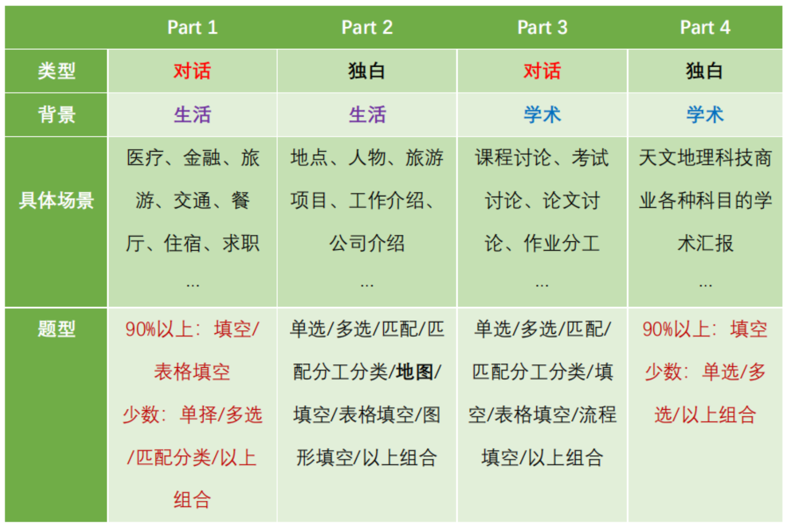
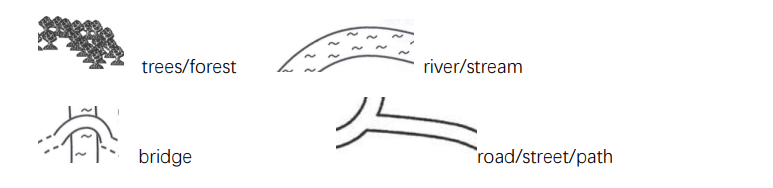
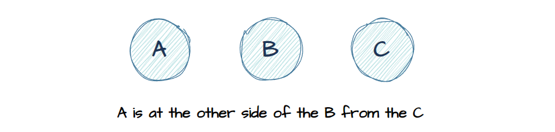
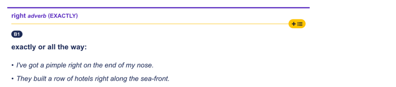
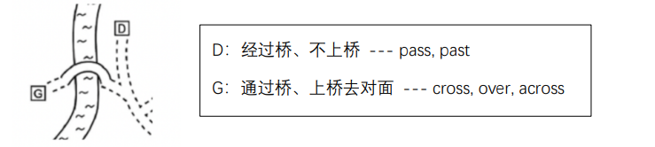

# 雅思听力方法

## 概述

### 做题步骤

1. 预读题目：画关键词、拼命往下预读、读懂题目内容；
2. 定位：听到什么就打勾，定位答案句；
3. 匹配：听到答案并拼写（听东西的时候不要看题目，可以看空白处，确定听到的内容后再去选对应的选项）。

### 听力练习方法

#### 听音

##### 单词发音

大量听写单词，拼写准确。

##### 语音现象

**连读：**

- 辅音 + 元音（a、e、i、o、u）；
- 辅音 + 辅音（如：next to）；
- 元音 + 元音：

```
前⼀个 /i:/ 或 /ɪ/ 结尾的元音+元音开头：加 /j/
例子：I (y)am

前⼀个 /u:/ 或 /ʊ/ 结尾的元音+元音开头：加 /w/
例子： do (w)it
```

**弱读：**

实词重度、虚词弱读。

**浊化：**

- s + p = s + b（如：sport）；
- s + t = s + d（如：stand）；
- s + k = s + g（如：skip）。

**同化：**

- 失去爆破：爆破音（t、d、k、g、p、b）后面遇到辅音时，前面的爆破音失去爆破（只做口型不发声）（如：football、good boy）；
- t + y 读成 /t∫/（如：meet you）；
- d + y 读成 /dʒ/（如：did you）。

**语调：**

慢读重读强调、语音语调。

#### 听义

##### 意群断句

意群：表示独立意思的小区块。

##### 顺句驱动

顺句：按句子的顺序理解，而不管语法上的翻译顺序（意识流）。

##### 精听跟读

1. 意群断句；
2. 一句句地听，不断重复，直到听懂（单词发音、语音现象、英语语法）；
3. 全文跟读、背诵、复述。

#### 听改写

同义词、近义词、解释、举例、花式改写。

#### 听逻辑

各 part 宏观逻辑：



细节逻辑：并列、否定、转折。

## 填空题

### 做题步骤

#### 预读题目

- 字数限制；
- 词性（大部分都是名词）；
- 没有挖空的句子可以先不预读；
- 填空前的冠词（a、an）和单复数、介词、比较级、最高级；
- 预判填空内容：数字、日期、时间、人名、组合。

> 日期的形式：日月年，日用基数词（20），不用序数词（20th），如：20 September 2023。

#### 定位答案句

……

#### 填词

- 大量听写（训练单词敏感度、拼写准确、熟记常用词汇：方位、季节、星期、月份、国家）；
- 同义替换改写；
- 要填最具体、指意最清楚的词；
- 一般不会填题干里已经出现过的词；
- 大小写不扣分（日期、人名等尽量首字母大写）；
- 单复数写错会扣分（单复数听写练习）；
- 含连字符算一个单词。

```
特殊发音：
Z：/zed/
W：double u
J for jacket（区别于G）
号码里的zero读作O
2个：double
3个：triple
23.7：23 pounds 7
```

### 特殊题型

- 流程填空题；
- 回答图片题；
- 图片填空题。

## 选择题

### 考察形式

- 单选：3/4 选 1；
- 多选：5 选 2，或 7/8 选 3（占多个题号，选项的顺序不影响）；
- 多在 part 2、part 3 出现。

### 做题步骤

#### 预读题目

- 先读所有题干问题，再读选项；
- 一开始就尽量多预读，不要等到 part2 才预读；
- 用一两个词来概括每个选项。

#### 定位答案句

……

#### 解题

- 听的不是某个单词有没有被提及，而是整体表达的意思；
- 注意排除干扰项：信息提及了，但是为否定、反义；信息提及了，但是不满足题目要求。

## 匹配题

### 考察形式

- 多在 part 2、part 3 出现；
- 普通匹配：选项比题目多，每个选项只能选一次；
- 分工匹配：题目比选项多，选项只有少量，可能要多选。

#### 预读题目

- 题目描述大多数时候（99%）不用看；
- 重点预读选项（会被同义替换）；
- 不用预读题目（顺序出现）；
- 相似或相反的选项可以连起来；
- 注意看清选项的主语。

#### 定位答案句

……

#### 解题

已选的选项直接划掉，排除干扰。

## 地图题

### 考察形式

- 非必考题，绝大多数出现在 part 2；
- 大多数为匹配选择合适的地点，少数为填空；
- 按题号顺序出题；
- 只关注对位置的描述，忽略功能、评价等描述；
- 只关注现状，忽略原本的计划、之前的改变等描述。

### 做题步骤

#### 预读题目

- 关注起点：entrance、gate、we are here；
- 关注方位：N、S、W、E；
- 熟悉地图结构以及其中的元素。

#### 定位打勾

熟记方位词、静态描述、动态描述。

#### 选择答案

已经选过的就划掉。

### 地图元素



```
boundary 边界
entrance ⼊⼝
side entrance 侧⻔
gate ⼤⻔
foyer ⼤厅
junction/intersection 交汇处
branch off 分叉路⼝
bend 转弯处/转弯
winding 曲折的
corridor ⾛廊
corner ⻆落
river bank 河岸边
circular 圆形的
rectangular ⻓⽅形的
right-angle 直⻆
semicircle 半圆形
square 正⽅形
oval 椭圆形
triangle/triangular 三⻆形
```

### 方位词

#### 静态描述

> 静态描述：对位置、相对位置、大小等的描述。

##### 位置定位词

东南西北：

```
north of the ...
out to the east 向东
around to the west 向西
on the south side of the ...
in the southern part/section of the ...
in the south-west corner of the ...
```

上下/左右/前后/中间：

```
at the top/bottom
left on the ...
on the right-band side
at the front of ...
at the back of ...
in the centre/middle of the ...
```

旁边：

```
next to the ...
near the ...
besides the ...
alongside the ...
close to ...
surround by ...
between ... and ...
on the same side as/of the ...
the corner of ... and ...
```

对面：

```
on/at the other side of the ... from ...
opposite
on xxx road across the road from ... 在马路对面
```



远处：

```
on the far side of the ...
```

##### 大小描述

```
the largest section is ...
the samllest one is ...
```

##### 两条路的交叉点

```
in the xxx street at the junction with xxx street
at the junction of xxx street and xxx street
on xxx road, facing/near the junction with xxx road
xxx street close to the intersection with xxx street
xxx street where it crosses xxx road
```

##### 一条路上的一个点

```
on the xxx street (in front of)/outside/by the entrance to/towards the store xxx
store xxx on/in the xxx street
```

#### 动态描述

> 动态描述：从一个起点开始动态移动（go/walk/move）。

##### 起始点

```
you are here
we are here at ...
we are standing at ...
we are in ...
lead off (from) ... 从...开始
staring point is ...
```

##### 向某个方向走

```
to/head to/towards ...
in the direction of ...
go (straight) ahead
go along
walk along
walk (straight) down
```

##### 经过/穿过

```
through/along/across/cross/over/past/follow/further/beyond ...
```

##### 转向

```
take the first left
tuen right
to your left
on your right
turning
on the (first) bend of the path
the path (first) bends
```

##### 到达

```
until you (get to)/reach the ...
before you get to the ...
in front of you
facing you
it's the first/second/last one you come to
at the end of ...
... turn off 转弯
the road ends at the ...
```

#### 注意事项

right on your left：

这里的 right 做副词，表示“恰好”，而不是“右边”。



过桥问题：


