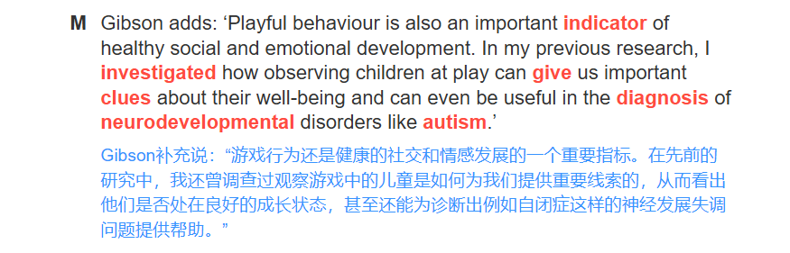
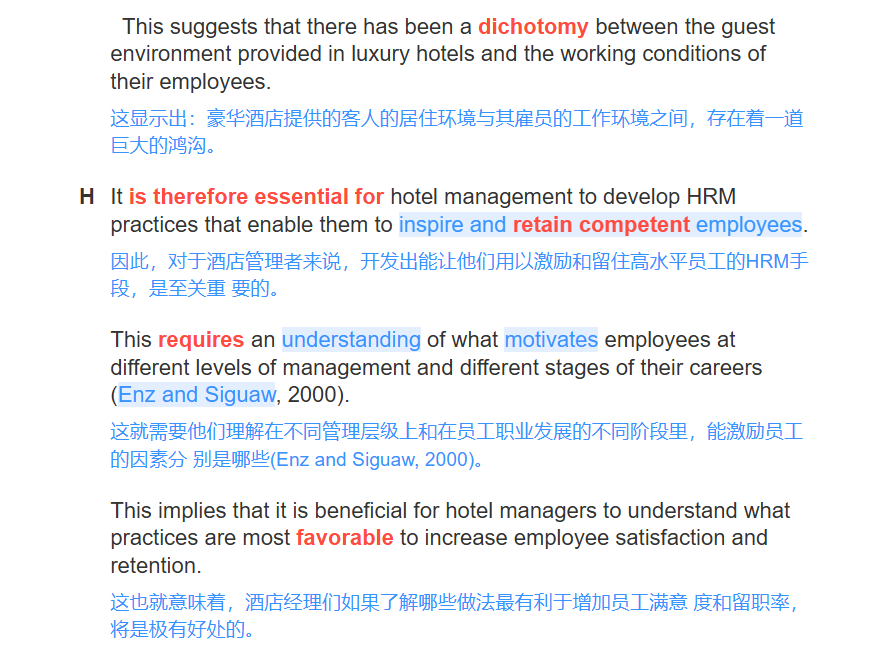

# 雅思阅读 - 真题练习

## 剑 14

### Test 1

#### Passage 1

#### Passage 2

#### Passage 3

### Test 2

#### Passage 1

#### Passage 2

#### Passage 3

### Test 3

#### Passage 1

#### Passage 2

#### Passage 3
