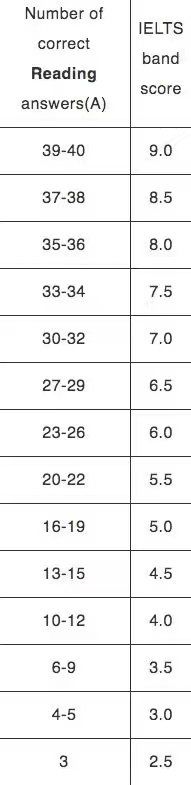

# 雅思阅读方法

## 概述

### 考试形式

学术类（A 类）：共 3 篇文章，40 道题，共 1 小时。

题目分类：

- 顺序题：判断、填空、单选、句子匹配；
- 乱序题：段落匹配、信息匹配、段落大意（Heading）；
- 特殊题：选标题、多选。

> 注意：顺序题，即出题顺序为文章从前到后；多种题型可能会交叉混合出现，分题型做题会导致重复阅读（解决：平行做题法）。

机考 tips：highlight、计时器、左右分屏。

### 评分标准



### 练习方法

- 要不要掐表做题？刚开始以提升准确率为主；
- 要投入、要真的读懂内容（不要当成是考试，不要只是当作零散的句子）；
- 笔考 1 小时三篇是包含书写答案的时间：推荐前两篇选完再写答案，第三篇边选边写（机考忽略）。

### 模拟网站

- 雅思官网；
- 同桌英语（推荐）；
- 新东方雅思猫。

## 平行做题法

### 一、预读题目，并画出关键词

#### 预读方法

##### 顺序题

- 每种顺序题预读前 2 道（多种题型要同时预读，不要只看一类题型）；
- 做完 1 道继续预读下 1 道，始终保持有 2 道题目已经预读。

##### 乱序题

- 预读所有题目；
- 人名匹配题可以等到文章第一次出现人名时再回来预读所有的关键词，因为越晚预读印象越深。

##### 特殊题

- 选标题：不用预读，读完全文再做；
- 多选题：当题目提供的信息足够时，预读题目即可；当题目提供的信息不足以定位时，需要预读选项。

#### 画关键词

##### 画什么

- 大写的专有名词、时间、数字、人名；
- 有具体内容的实词；
- 比较级、最高级、否定词（尤其是判断题）；
- 填空前的冠词（单复数）、并列。

##### 不画什么

- 常见题干词，如：reference、account、mention、refer 等；
- 全文反复出现的词；
- 没有具体内容的虚词，如：of、is、it 等。

### 二、定位题目

带着关键词去读一遍文章，根据原词或者同义替换改写来定位，遇到什么题做什么题。

重点关注：

- 转折词：转折后的是重点内容；
- 并列词：并列的内容同样重要（尤其是填空题）；
- 因果关系词：分清因和果；
- 举例子：观点 + 举例；
- to + 动词：表目的，经常对应：aim、goal、objective 等；
- 代词：去前一句找指代对象。

### 三、选择答案

……

## 阅读速度提高

### 词汇积累

- 《训练营高频词汇》；
- 《雅思词汇真经》；
- 精度真题中的阅读文章，学习不会的词汇。

### 语法提高

- 学会抓句子主干（主谓宾、主系表）；
- 按照句子顺序理解，不要重复翻译：
  - 宾语从句和表语从句：按顺序往下翻；
  - 介宾 A of B 表示从属时：翻译成“B 的 A”（被动 + by 同理）；
  - 定语从句和同位语从句：重复一下先行词。
- 同位语速读：介绍某人是某个大学某个职务，这种可以直接跳过。

### 阅读方法

- 平行阅读法：预读题目，不重复阅读文章；
- 结构化阅读：抓关键观点，注意【观点 + 解释/举例】，适当略读。

## 判断题

### 逻辑判断

#### TRUE

- 同义替换改写；
- 概括总结。

#### FALSE

- 反义词；
- 否定；
- 概括总结；
- 不相符，且情况唯一。

示例：

```
证据：
It is now clear/has proven……
not clear/no proof/no evidence……

数量：
few：表否定，几乎没有，相当于no
a few：表肯定，有一些，相当于some

以下三种描述互相冲突：
a/one/the only……
some、majority/most……
all/every……
```

#### NOT GIVEN

- 没有提及；
- 无中生有的比较；
- 不相符，但情况不唯一（题目和文章可以同时成立）。

示例：

```
原文：小明喜欢吃苹果
题目：小明喜欢吃西瓜（NOT GIVEN）
```

### 解题技巧

- 当信息不相符时，用是否具有唯一性辨别 FALSE 和 NOT GIVEN；
- 要搞清楚两个词是不是一个逻辑、是不是一个纬度、是不是在讨论同一件事，谨防“偷换概念”；
- 顺序、数量、最高级具有唯一性：

```
the first = more than any/all other …
the most XX = more … than any/all other …
```

- 范围变化是单向的同义替换：

```
原文：小明养了一条哈士奇
题目：小明养了一条狗（范围变大，true）

原文：小明养了一条狗
题目：小明养了一条哈士奇（范围变小，not given）

原文：小明养了一条哈士奇
题目：小明没有养狗（不相符，false）
```

- 并列关系中单独拿一个出来是没有问题的，但要注意是否有唯一性、一致性；
- 不能否认过去已经发生的事实。

### 注意事项

- 注意审题，若题目要求写 TRUE/FALSE/NOT GIVEN，那就不能写成 YES/NO/NOT GIVEN；
- 可以简写为 T/F/NG 或 T/N/NG（最好不要简写，按题目的要求来写最保险）。

## 填空题

### 考察形式

- 总结填空；
- 表格填空；
- 句子填空；
- 选词填空；
- 图片填空；
- 回答问题（考得少）。

### 解题技巧

- 并列关系：并列中可以改变顺序；并列中可以单独拿出其中一两个；

```
A and other B = B such as/including A

示例：
小明喜欢吃苹果以及其它水果 = 小明喜欢吃水果，比如苹果
```

- 填空前的冠词应该对应，如：the、a、an、some、数字等；
- 注意填空前的否定词。

### 注意事项

- 大小写不扣分；
- 答案通常是文章原词，照抄即可；
- 答案通常不会是题干中已有的词；
- 要填最具体、意义最明确的词；
- 像 unit、metrics、one、each、some 这种度量/单位/限定/代词之类的词一般不填，没有实际意义。

## 单选题

### 考察形式

- 四选一，一般连选 3-5 道；
- 好定位，一般一段就出一道题。

### 解题技巧

细节对应（80%）：

- 一个或多个答案句的同义替换；
- 将每一个选项当作判断题来做；
- 问 example、exemplify（证明）的作用，就找原文的【观点 + 举例】中的观点句；
- 问 this、that、it 指代什么，就看代词指代的前一句；
- 原文中的【to + 动词】表目的。

段落理解（20%）：当 Heading 题来做。

### 注意事项

- 题干词 reviewer、writer 指本文作者；
- 选项中的原词很多时候是干扰，要看的不是某个单词，而是整体的意思是不是一致（越来越考察理解：放弃幻想，提升基础）。

## 多选题

### 考察形式

- 五选二最常见、也可能七选三/八选三/七选四，一般考 1-2 道；
- 占两个题号，对一个就得一个分，书写顺序不影响；
- 出题顺序比较特殊：可能集中某段，也可能分布全文。

### 解题技巧

- 有些可以根据题目直接定位；当题目提供信息不足以定位时，需要预读选项来定位；
- 单个选项的判断思路与单选题一致。

## 段落匹配题

### 考察形式

- 选 paragraph：只有一段；
- 选 section：包含多段。

### 解题技巧

- 该题型为乱序题，需要预读全部题目并画关键词；
- 考察局部包含，原文只要提及题目信息就能直接选；
- 每读完一段就可以回头看一下有没有合适的选项；
- 不确定的可以先选几个并做标记，后面再确定；
- 题目看到 future、predict 等词一般重点关注最后一段/几段。

### 注意事项

- 注意题干里的单复数；
- 注意题干主体描述的到底是谁（人、事、物）；
- 不一定每个段落都考到；
- 注意有无 NB，答案可能重复（同一个段落被选择多次）。

## 信息匹配题

### 考察形式

- 人名匹配（statement）；
- 年代匹配（date）；
- 公司匹配（company）；
- ……

### 解题技巧

- 该题型为乱序题，需要预读全部题目并画关键词；
- 将人名等关键词简写为一个大写字母，更直观清晰。

### 注意事项

- 注意有无 NB。

## 句子匹配题

### 解题技巧

- 题干 + 正确选项 = 文中答案句的同义替换。

## Heading 题

### 解题技巧

- 该题型为乱序题，需要预读全部题目并画关键词；
- 每读完一段就来选，先排除掉不合适的，不确定的可以先选几个，读完后面的再来确定；
- 选的是段落大意/核心观点，而不是某个细节/片段，答案应该是段落中心句的同义替换（当段落主要描述实验研究时，应重点关注实验结论）；
- 可能有示例，直接划去不看；
- 遇到 future、predict 等词，一般重点关注最后一段或几段。

### 与段落匹配题的区别

| 段落匹配题                         | Heading 题                         |
| ---------------------------------- | ---------------------------------- |
| 给出描述，选对应的段落（局部细节） | 给出段落，选对应的标题（概括总结） |
| 只要提及就可以选                   | 必须要选段落大意、概括理解         |
| 一般只考部分段落                   | 每个段落都要选一个 Heading         |
| 核心是同义替换                     | 核心是理解段落结构                 |

## 选全文标题

### 解题技巧

- 选文章的中心思想（能代表整篇文章的内容）；
- 选全文反复提及、其它题目中反复出现的内容。
